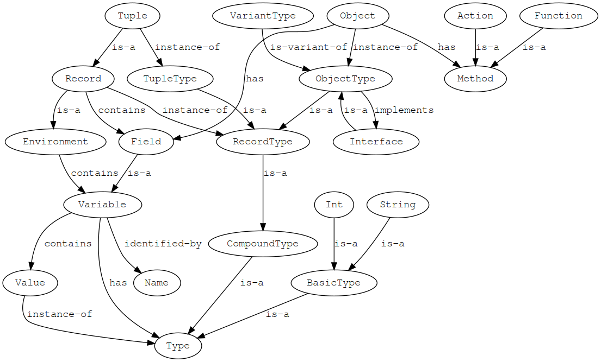
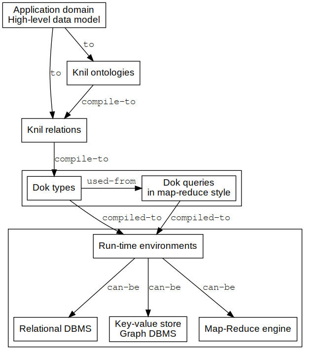

#+TITLE: Dok Programming Language v0.1.4
#+AUTHOR: Massimo Zaniboni
#+EMAIL: mzan@dokmelody.org
#+CREATOR: Emacs Org mode
#+LANGUAGE: en
#+TODO: TODO MAYBE IMPLEMENT | DONE CANCELED
#+BIBLIOGRAPHYSTYLE: unsrt
#+BIBLIOGRAPHY: citations plain
#+ARCHIVE: archive.org
#+OPTIONS: toc:2 num:nil
#+HTML_HEAD: <link rel="stylesheet" type="text/css" href="org.css"/>

* License 
This manual is released under ~SPDX-License-Identifier: CC-BY-4.0~

Copyright (C) 2019 Massimo Zaniboni - mzan@dokmelody.org
* Current status 
The design of the language is a work in progress and all can change.

There is no compiler or interpreter of the language, so it is all vaporware. I'm publishing this mainly for self-motivation.
* Quick tour
#+BEGIN_SRC fundamental :tangle yes
Assert {

  Assert {
    io!println("Hello World!")

    s1::= "Hello"
    s2::= "World"
    io!println(s1 ++ " " ++ s2)

    !helloWorld(weather::String) --> {
       try {
         weather == "sunny"
         io!println("Hello World!")
       } else {
         io!println("Huh")
       }
    }

    !helloWorld("cloudy")
  }

  Assert {

    Int.factorial1 --> Int {
      try {
        self == 0 
        1
      } else {
        self * (self - 1).factorial1
      }
    }

    Int.factorial2 --> Int {
      r::= 1
      n::= 2
      repeat {
        while { n <= self }
        r:= r * n
        n:= n + 1
      }
      r
    }

    Int.factorial3 --> Int {
      List(Of:Int).range(from: 1, to: self).product
    }

    4.factorial1 == 4.factorial2 == 4.factorial3
  }

  Expr(To::Type) --> (
    #: This is a new type `Expr` used for representing expressions.
    #  The param `To` represent the result of the expression evaluation.

    /Int(To:Int) --> (x::Int)
    # This is `Expr/Int` type variant
    # with the `Expr/Int.x` field of type `Int`
  
    /Bool(To:Bool) --> (b::Bool)

    /Add(To:Int) --> (x::Expr(Int), y::Expr(Int))

    /Mul(To:Int) --> (x:Expr(Int), y:Expr(Int))

    /Eq(To:Bool) --> (x:Expr(Int), y:Expr(Int))

    eval --> Self.To {
      #: A function evaluating an `Expr` 
      #  and returning its result of type `To`.
      #  It is written in a functional-programming style 
      #  because there is a pattern-matching for every possible
      #  variant of an expression.
      #  `@Case` is a metaprogramming macro.
      @Case[self.is(~)] {
        ./Int
        #:NOTE: the `@Case` macro is expanded to 
        #       `self.is(./Int)` code

        self.x
        # this is the result of the branch 
        # if the previous conditions are respected
      } else {
        ./Bool

        self.b
      } else {
        ./Add

        self.x.eval + self.y.eval
      } else {
        ./Mul

        self.x.eval * self.y.eval
      } else {
        ./Eq

        self.x.eval == self.y.eval 
      }
  )

  e::= Expr/Add(x: ./Int(10), y: ./Int(20))
  e.eval == 30
}
#+END_SRC
* Design philosophy
  :PROPERTIES:
  :CUSTOM_ID: design-philosophy
  :END:
Dok is a data transformation and metaprogramming (i.e. code is data) language.

Dok programs are preferably developed using progressive refinements from high-level code to low-level code:
- high-level code can be used as specification of low-level code
- many different branch implementations of the same parent code can be derived for supporting different run-time environments and usage scenario
- meta-annotations inside code and compiler-plugins can be used for deriving automatically low-level code from high-level code
- a complex problem can be partitioned in rather orthogonal aspects

Like Smalltalk, Dok is shipped with a reference IDE (DokMelody), because interaction between the programmer and the programming language is not a secondary aspect. Unlike Smalltalk, generated applications are not obliged to live in the same virtual environment of the IDE, but they can be compiled to different hosting platforms and runtime environments.

Dok programming language design follows these guidelines:
- whenever possible values are preferred to references
- nested transaction semantic joins some of the benefit of functional programming (code with a predictable semantic) with imperative programming (convenience of local mutable state) 
- every part of a Dok application can be meta-annotated and then manipulated through an extensible compiler
- simple types can be extended with contracts (i.e. logical properties)
- advanced features of the language are supported using compiler-plugins that can perform (local or global) analysis and transformation of the source code
- compiler-plugins effects must be always inspectable using the DokMelody IDE

Dok syntax guidelines are:
- code must be readable from left to right (e.g. ~x.f.g(y)~ instead of ~g (f x) y~)
- curly braces simplify refactoring of code respect mandatory indentation
- code formatting is under the control of the IDE
* Values
  :PROPERTIES:
  :CUSTOM_ID: values
  :END:
Values are expressions that are fully evaluated (i.e. normalized form). 
For example =3= is a value of type =Int=, while =2 + 1= is a n expression that can be further normalized
 (simplified) to the value =3=.

Values are immutables.
** Primitive values
Int, Float, String and so on are primitive values. They can not be further decomposed.

#+BEGIN_SRC fundamental :tangle yes
Assert { 

 3.is(Int) 
 (3 + 1).is(Int)
 (3 + 1) == 4

 "three".is(String)
}
#+END_SRC
** Variables
A variable is a name used as unique identifier inside an environment and associated (always inside the environment) to a value. The associated value can be changed, so the name variable.

Dok uses mutable variables like imperative languages but they are associated to values and not references. Doing so there are no reference aliasing problems because the value of a mutable variable depends only from the instructions executed in the same static (lexical) context of the variable, and not from the more complex run-time behaviour.

As in functional-programming languages values are used also for managing complex data structures as containers, and not only for basic values like int or string.

#+BEGIN_SRC fundamental :tangle yes
Assert {

  r --> Int {
    b::= 2 
    c::= 3 
    #:NOTE: `b` and `c` are two local mutable variables associated to two values of type `Int`

    b + c 
    #:NOTE: the last line of a code block is its result
  }

  r == 5

  Assert { 
    x::Int    # declare a new variable inside this code block, without specifying a value

    x:= 1     # assign a value to the variable 
    x == 1

    x:= x + 1 # change the value 
    x == 2

    y::= x 
    y == 2

    Assert {

      x1::Int
      #:NOTE: we can not assign again `x` name to this variable
      #       because it will be a name-clash with the parent variable.
      #       Dok does not allow this for mantaining clarity of the code.
    }
  }

  # here `x` is not anymore visible (lexical scoping)
} 
#+END_SRC
** Records
   :PROPERTIES:
   :CUSTOM_ID: record
   :END:
A record is a compound value: it contains associations between field names and field values. Fields in records are like variables in an environment. 

#+BEGIN_SRC fundemantal :tangle yes
Assert {   
  x::= (i::= 1, s::= "one")
  x.is(Record)

  x.i == 1
  x.i.is(Int)

  x.s.is(String)
  x.s == "one"
}

Assert {
  P --> (x::Int, y::Int )
  # `P` is a type of record with fields of the specified types.

  G --> (p::P, l::Int)
  # `G` is the type of a record having the field `p` with type `P`

  p1::= P(x:= 1, y: 2) 
  g1::= G(p: p1, l: 3)
  # create two record values of type `P` and `G`

  g1.p.x == 1 && g1.p.y == 2 && g1.l == 3
  # access value of fields

  p1.x:= 4 
  #:NOTE: we are saying this `p1:= P(x: 4, y: 2)`
 
  p1.x == 4 && p1.y == 2

  g1.p.x == 1 
  g1.p.x !== p1.x
  #:NOTE: the variable ``g1`` is unchanged because it is associated to the same old value.
  #       In a traditional object-oriented programming language, ``g1.p`` contains a reference to ``p1`` 
  #       and so changing ``p1`` affect also ``g1.p.x``.
}

Assert {
  P --> (p::Int)
  S --> (s::P)

  x::S
  x.s.p:= 0
  #:NOTE: this is equivalent to `x:= S(s: P(p: 0))`
  #       because in Dok I have only values and not references

  x.s.p == 0
  x.s == P(p: 0)
  x == S(s: P(p: 0))
 
  x == S(P(0))
  #:NOTE: in case of single fields it is possible omitting the names
}
#+END_SRC
** Tuples
   :PROPERTIES:
   :CUSTOM_ID: tuple
   :END:
A tuple is like a [[#record]], but in which the position of the fields is important, and in some cases the field name can be omitted in favour of the position.

Tuples are used mainly as arguments of functions, because functions can be called without specifying the argument name, e.g. ~10.mod(2)~.
** Containers as values (Persistent Data Structures)
Like in functional programming languages, also compound types (e.g. records, containers, etc..) are values.

Containers that are values are called Persistent Data Structures and there are various efficient implementations of them. They allows also efficient rollback of changes in case of [[#nested-transaction-semantic]]. 

The semantic of persistent data structures simplifies the reasoning on code behavior because it suffices to see the scope where a container is used, instead of taking in account also aliasing and its global run-time behaviour.

Dok supports also references and in-place mutable containers, but they are rarely used.

This is an usage example:

#+BEGIN_SRC fundamental :tangle yes
Assert { 

  m1::= Map(From: Int, To: Int) 
  #:NOTE: `Map` is a value in Dok. In this case we are starting from the empty Map.

  m1(1):= 1
  #:NOTE: this can be expanded into ``m1:= m1.insert(1, 1)``, 
  #       and it returns a new version of the ``Map`` value and assign it to the mutable variable

  m1(2):= 2 
  m1(3):= 3

  m2::= m1 
  #:NOTE: we are copying values, not references, so it is like a clone
  #       from a semantic point of vie, 
  #       also if internally Dok will use more efficient approarch

  m1(2):= 4
  #:NOTE: this can be expanded into ``m1: m1.insert(2, 4)`` 
  #       and return a new version of the `Map` value

  m2(2) == 2
  #:NOTE: `m2` is not affected by `m1` change because it is still the original value
} 
#+END_SRC
** Common containers
*** ~Maybe~
#+BEGIN_SRC fundamental :tangle yes
Assert {
   Maybe(Of::Type) --> (
     #: A value that can have "no-value".

     isNothing --> Bool
     isJust --> Bool { not (self.isNothing) }

     /Nothing --> (
       isNothing -> { True }
     }

     /Just --> (
       just::Of

       isNothing --> Bool { False }
     )
   )

   Any --> Maybe(Of::Self) {
     #: Automatic conversion to Maybe.
     Maybe/Just(self)
   }

   Maybe(Of::Type) --> Of {
     #: Automatic conversion from /Maybe/Just type to wrapped type. 
     #  Fail if it is Nothing

     self.isJust
     self.just
   }

   Assert {
     x::Maybe(Int)
     x:= Maybe/Just(5)

     x.just == 5
     x.isJust == True
     x.isNothing == False
     x.is(Maybe)
     x.is(Int) #:NOTE: apply inverse conversion
     x.just == x.Int == 5
     x.just == x #:NOTE: apply automatically conversion to Int

     y::= 5
     y.is(Int)
     y.Maybe.is(Maybe)
     y.is(Maybe)
     y.isJust
     y.just == y == 5
   }

   # Because `Maybe` is used a lot, the compact form `Type?` can be used instead

   Assert {
     x::Int?
     x.is(Int?)
     x.is(Maybe(Int))

     x:= 5 #:NOTE: automatic conversion from Int to Maybe(Int)
     x.is(Maybe/Just)
     x.is(Int)
     x.just == 5 == x
   }    
#+END_SRC
*** ~List~
#+BEGIN_SRC fundamental :tangle yes
   List(Of::Type] --> (
     #: List is a container containing a finite sequence of values of the same type

      @Abstract

     

      head::Of?

      tail::Self

      isEmpty --> Bool

      get(i::Int) --> Of {
        @Abstract
        @UseArraySyntax
        #:NOTE: list elements can be retrieved with ``someList(pos)``
        #       where ``pos`` is an `Int` starting from ``0``.
      }

      !set(i::Int, value::Of) --> Self {
        #: The position must be an already filled position

        @Abstract

        @UseArraySyntax
        #:NOTE: support ``someList(0):= someValue``
      }

      !append(toTail::Of) --> Self {
        #: append an element to tail
        @Abstract
      }

      !append(toTail::Self) --> Self {
        #: append another list of exactly the same physical type to tail
        @Abstract

        @SelectPriority
        #:NOTE: favour this respect other functions with similar name defined after this
      }

      !append(toTail::Container(Of)) --> Self {
        #: append another container to tail
        @Abstract
      }
   )

   # Because list is used a lot it can use the compact `Type*` form
   # and the compact ``(x, y, ...)*`` form

   Assert {
     x::= Int* 
     x.is(List(Int))
     x.isEmpty 
     x!append(1) 
     x!append(2)
     x.head == 1
     x.head == Just(1)
     x.head.just == 1

     y::= (3, 4, 5)*
     y.is(List(Int))
     y(0) == y.head == 3
     y(1) == 4
     y(10) == Nothing
    
     y(3) == Nothing
     y!append(6)
     y(3) == 6
     y!set(3, 7)
     y(3) == 7
     y(3):= 8
     y(3) == 8
  } 
#+END_SRC

*** ~Array~
#+BEGIN_SRC fundamental :tangle yes
  Array(from::Int, to::Int, Of::Type) --> (
    #:NOTE: Stores consecutive elements in a (rather) efficient way

    @Abstract

    get(i::Int) --> Of { 
      @Abstract

      @UseArraySyntax
 
      @Require { i >=Self.from && i < Self.to } 
    }

    !set(i::Int, value::Of) --> Self {
        @Abstract
        @UseArraySyntax

        @Require { i >= Self.from && i < Self.to }
    }
  )

  Assert {
    a::Array(from: 1, to: 10, Of: String)
    a(0):= "Zero"
    a(1):= "One"
    a(1) == a.get(i)
  }
#+END_SRC
** ~T*~ ~T+~
 ~T*~ is the type of a value containing zero or more instances of ~T~ type. ~T+~ is like ~T*~ but it had to contain at least one instance, i.e. it can not be empty.

 In Dok ~T*~ concrete type can be something like ~List(T)~, ~Stream(T)~, ~Array(T)~. 
 Then the compiler can infer the minimal and more efficient data structure to use according the real usage in the code and/or hints of the programmer. 

 This compact form is used because it simplifies the specification of syntax/grammars.
* Object Oriented Programming (OOP)
Dok joins object-oriented-programming (OOP) with some functional-programming (FP) concepts. The main differences respect traditional OOP are that in Dok:
- objects are values (like in FP) and not references (as in OOP)
- concrete objects are used (mainly) for representing hierarchical data (e.g. source code, documents, etc..), and so more like FP sum types than OOP subclasses
- inner class (inner types in Dok terms) are used a lot more than in traditional OOP, because they introduce service types describing parts of hierarchical data

Like in OOP and FP, concrete types can support abstract interfaces representing abstract concepts.

The design guidelines are:
- OOP conceps are used for representing physical hierarchical data, and for defining an hierarchy of logical interfaces 
- FP concepts are used for using less error-prone values instead of references, and for using functions as arguments of other high-level functions, maximizing code reuse
- more advanced FP features are replaced from the usage of meta-programming
** OOP terms
The terms used from Dok are a mix of OOP and FP terms:
- type: identify a domain of values having some common logical or physical (i.e. physical storage format) characteristics.
- value: instance of a type, i.e. a value inside the domain of the type.
- record: a compound value containing fields. It is like an environment, where fields are variables.
- tuple: a record where the position of the fields matters.
- object: like a record, but it can contains also non-mutable methods.
- method: like a field of an object, but it can have arguments and it have some code that is executed for returning the value associated to it. 
- function: a method of an object that is referentially transparent (i.e. pure) respect its arguments, the fields and methods of the objects and the variable values of the environment where its object is defined.
- action:  a method of an object that can update the fields of the objects or the variables of the lexical context in which it is defined. It can optionally also return a value.
- interface: an object-type with some abstract properties that can be supported from other concrete object-types. 
- variant type: given a parent object-type, it can have one or more variant types supporting all the methods of the parent type, overriding some of them, or adding new methods. The variant types unifies the OOP idea of inheritance with the FP idea of sum types with variants.
- inner type: it is a type defined inside the namespace of a parent object-type, and usually defining concepts making sense only related to the owner type. In OOP it is called inner class.

This is a graph for giving an informal idea:

#+BEGIN_SRC dot :file dot_success.png :cmdline -Kdot -Tpng
digraph {
  Variable -> Type[label="has"];
  Variable -> Name[label="identified-by"];
  Variable -> Value[label="contains"];

  Environment -> Variable[label="contains"];

  Record -> RecordType[label="instance-of"];
  Record -> Environment[label="is-a"];

  Field -> Variable[label="is-a"];
  Record -> Field[label="contains"];

  CompoundType -> Type[label="is-a"];
  BasicType -> Type[label="is-a"];
  Int -> BasicType[label="is-a"];
  String -> BasicType[label="is-a"];
  ObjectType -> RecordType[label="is-a"];
  ObjectType -> Interface[label="implements"];
  Interface -> ObjectType[label="is-a"];

  VariantType -> ObjectType[label="is-variant-of"];
  Object -> ObjectType[label="instance-of"];

  RecordType -> CompoundType[label="is-a"];
  TupleType -> RecordType[label="is-a"];
  Tuple -> Record[label="is-a"];
  Tuple -> TupleType[label="instance-of"];

  Object -> Method[label="has"];
  Object -> Field[label="has"];
  Function -> Method[label="is-a"];
  Action -> Method[label="is-a"];

  Value -> Type[label="instance-of"];
}
#+END_SRC

#+RESULTS:

** Type variants
   :PROPERTIES:
   :CUSTOM_ID: type-definition
   :END:
Type variants are specified using an hierarchy of variant types (i.e. algebraic sum types) and specifying only the differences respect their parent type. So it is a mix of algebraic data types like in functional programming languages and OOP sub-class.

Type variants must respect the same implicit and explicit contracts of the parent type, because every time a parent type is expected, a specific variant can be sent instead.

Only most specific leaf type variants can be instanced directly, all other parents of the hieararchy are implicitly assumed =Abstract=.

#+BEGIN_SRC fundemantal :tangle yes
@Assert { 
  T --> ( 
    a::Int
    # this is a field of the type, and its value can change at run-time
 
    f --> String
    # this is a function of the type, and its value can not change at run-time
    # It is abstract, and it will be specified for variant types.

    HelloWorld --> String { "Hello World!" }
    # this is a static function because it starts with an upper case letter, 
    # and it is associated to `Self` type, instead of `self` object.

    /A --> ( f -> String { "T/A" } )
    #:NOTE: `T/A` is a type variant of `T`

    /B --> ( f -> String { "T/B" } )
    #:NOTE: `T/B` is another type variant of `T`
  )
} 
#+END_SRC
** Overriding
Type variants can override fields and methods of parent type like in normal object-oriented languages. Also types of the methods can be redefined during overriding (see [[#type_conformance]]).

For making explicit that a field or method is redefined the syntax ~:~ and ~->~ is used instead of ~::~ and ~-->~.
*** ~super~
~self.super()~ in an overrided method, calls the original (non overridden) version accordin the OO hierarchy.

~super~ is also used for acessing the ~self~ field inside a nested lexical scope. See this example:

#+BEGIN_SRC fundamental :tangle no
Assert {
  l1::= (1, 2, 3, 4, 5, 6)*
  l2::= (8, 10, 50)*
  l1.filter({l2.any({ self == super * 2 })}) == (4, 5)*  
}
#+END_SRC

Both the OO hierarchy and the lexical scope are static properties of the code, so the usage of the same keywords make sense.
*** ~this~
~self.this()~ call the current method, and it is used for recursive functions.
** Type references
If there are no name clashes in the types, Dok can use short type names like ~B~ instead of ~/A/B~. The rules are:
- =/Self/T/G= for referring to some nested internal variant type,
  starting from the root parent type declaration
- =/SomeType/T/G= for referring to some nested variant type, of an
  external type =SomeType=
- =T/G/H=, in this case =T= must be a type without name clash, and so it
  must identify in an non ambiguos way the starting type chain. You must
  use this from when for example there is a name clash on =G= type name
- =M.T/G/H= in case =M= is a named module, containing the type =T=
** Type extension
   :PROPERTIES:
   :CUSTOM_ID: type-extension
   :END:
Types can be extended adding new fields, methods and nested variant types to them.

#+BEGIN_SRC fundamental :tangle yes
@Assert {

 P --> ( 
   p::Int

   f --> Int { self.p + 1 }

   /T::(
     t::Int
   )
 )

 # we can extend `P`

 P -> ( 

   q::Int
   #:NOTE: we added a new field to the type

   g --> Int {
     #:NOTE: we added a new function to the type 
     self.f + self.q 
   }

   /T -> (
     #:NOTE: we are extending `P/T` type variant
     l::Int
   )

   /W --> (
     #:NOTE: we are adding a new type variant to ``P``
     w::String
   )
 )
} 
#+END_SRC
** Type conversion
In Dok it is possible converting between types.

#+BEGIN_SRC fundamental :tangle yes
Assert { 
 CartesianPoint --> (x::Double, y::Double)

 PolarPoint --> (distance::Double, angle::Angle)

 PolarPoint --> CartesianPoint { 
   #:NOTE: we are defining the default conversion function.
   #       Every time a `CartesianPoint` is expected, 
   #       we can use a `PolarPoint` instead,
   #       because the conversion function can be invoked.
   #       The compiler whenever possible will avoid to create 
   #       an explicit value of type `PolarPoint` and it will
   #       apply inline conversions.

   r::CartesianPoint
   r.x:= self.r * self.angle.cos
   r.y:= self.r * self.angle.sin

   r
 }

 CartesianPoint --> PolarPoint { 
   #:NOTE: we are defining the inverse conversion 

   r::Cartesian 
   r.distance:= ((self.x ^ 2) + (self.y ^ 2)).sqrt
   r.angle:= (self.x, self.y).atan2
   r
 }

 p1::= PolarPoint(distance: 5, angle: 1)

 p1.CartesianPoint.PolarPoint == p1 
 # we are calling the two conversion functions in sequence, 
 # and then the same value should be returned.
 } 
#+END_SRC
** Interfaces
   :PROPERTIES:
   :CUSTOM_ID: interfaces
   :END:
Interfaces are types defining some general concept that can be
supported from many distinct types, e.g. =Comparable=, =Storeable=.
They are a powerful abstraction mechanism because a lot of generic code can be written for working with types respecting the contracts of one or more interfaces and then this code can be used for any effective type supporting the interface.

From a certain point of view if values are instances of types (i.e. the type describe the characteristics of the value), then types are instances of interfaces (i.e. the interface describes the characteristic of the type). From another point of view interfaces are like additional types associated to a value. So from the point of view of the value they are a form of multiple inheritance.
*** Definition
 In Dok interfaces are types with the ~@Abstract~ annotation. 
 They can contain default implementations for their functions, 
 but they can not contain type variants.

#+BEGIN_SRC fundamental :tangle yes
Assert {

 Comparable --> ( 
   @Abstract
   #:NOTE: this annotation says that this is a in Interface,
   #       so there can not be direct value instances.
   #       The name `Abstract` is used instead of `Interface`
   #       because the same name is used also for functions.

   compare(with::Self) --> Ordering {
     @Abstract
   }

   x < y --> Bool {
     x.compare(y) == Ordering/LT

     @Transitive
     @Irreflexive
     @AntiSymmetric
   }

   x > y --> Bool {
     not (x.compare(y) == Ordering/LT)

     @Transitive
     @Irreflexive
     @AntiSymmetric
   }

   x == y --> Bool {
     x.compare(y) == Ordering/EQ
     @Transitive
     @Reflexive
     @Symmetric
   }

   x <= y --> Bool {
     x < y || x == y

     @Transitive
   }
 
   x >= y --> Bool {
     x > y || x == y

     @Transitive
   }
 )
#+END_SRC
*** Interfaces hieararchy
An interface can require that the type supporting it will support also one or more other interfaces.

#+BEGIN_SRC fundamental :tangle yes

 Semigroup --> ( 
   x .op. y --> Self {
     @Abstract
     @Associative
   }
 )

 Monoid && Semigroup --> (
   Identity --> Self { 
     @Abstract 
     @Ensure {
       x .op. Self.Identity == x
       Self.Identity .op. x == x
     }
   } 
 )
#+END_SRC
*** Interface instances
A type =A= implements an interface =B= through the specification of a conversion from =A= to =B=. 

#+BEGIN_SRC fundamental :tangle yes
 Int -> Comparable ( 
   #:NOTE: we are saying that we can convert a value
   #       of type `Int` to a value of type `Comparable`,
   #       and that this is the default conversion to apply
   #       every time a function requiring a `Comparable`
   #       receives an `Int`.
   #       So we are saying that `Int` supports/implements interface `Comparable`. 

   x `compare` y -> Ordering { 
     x.compareIntBuiltIn(y) 
   }
 )

 c1::= Int(5)
 c1.is(Int)
 c1.is(Comparable)
 c1 == c1
 c1 == 5

 c2::=Int(6)
 c1 < c2
#+END_SRC
*** Interface constraints
    :PROPERTIES:
    :CUSTOM_ID: interfaces-constraint
    :END:
A type constraint can specify one or more interface constraints
 
#+BEGIN_SRC fundamental :tangle yes
 T --> ( 
   g(x::Ord && Associative) --> Int { 0 }
   #:NOTE: `x` parameter must support these two interfaces
 )

} # close the Assert
#+END_SRC
** Type aliases
   :PROPERTIES:
   :CUSTOM_ID: type-alias
   :END:
Dok supports type aliasing using an alternative form of [[#interfaces-constraint]] where an effective type (i.e. the aliased type) is extended with a new interface (i.e. the type alias).

An Haskell type alias like ~type Age = Int~ in Dok is:

#+BEGIN_SRC fundamental :tangle yes
@Assert { 

  Int --> Age( 
   @Ensure { self >= 0 }
   #:NOTE: we can add additional constraints and methods to `Age`

   isMajor --> Bool { self >= 18 }
  )

  x::= Age(16)
  x.is(Age)
  x.is(Int)
  x == 16

  x:= x + 2
  x == 18
  x.isMajor

  y::= Int(16)
  y.is(Int)
  not (y.is(Age))
  #:NOTE: every `Age` is an `Int`, but not every `Int` is an `Age`
 
  z::Age
  z:= y.Age
  #:NOTE: the compiler derived the type conversion

  z.is(Age)
  z == 16
  not (z.isMajor)
} 
#+END_SRC
** Fields vs methods
Fields can be changed at run-time. On the contrary methods can not be changed at run-time,
because semantically the body code is part of the contract of the
application, and from a practical point of view, a too much dynamic
system is slower (the compiler can not apply some optimizations).
** Private fields and methods
   :PROPERTIES:
   :CUSTOM_ID: private-properties
   :END:
 Fields and methods starting with =_= are private, i.e. they can be accessed only from functions
 of the type, and from types defined in the same module, but not accessed
 directly from the external. So they contains internal low-level implementation details.

#+BEGIN_SRC fundamental :tangle yes
Assert {

  PE --> ( 
    _x::Int 
    _y::Int
  )
#+END_SRC
** Unnamed variables
   :PROPERTIES:
   :CUSTOM_ID: unnamed-properties
   :END:
Variables with name =_= are considered unnamed. They are used usually in DSL and metaprogramming code when something has certain properties but it can be ignored because it is never used, for example in parsers for denoting text to parse but discard.
** Value constructors
Values must be initialized: all fields must be set to an initial
value, and type invariant must be respected. 

Every type can have special functions, called constructors, for creating and initializing a value.

#+BEGIN_SRC fundamental :tangle yes
Assert {
   Point --> (
     x::Double
     y::Double
     #:NOTE: this field is declared, but not initialized to a default value.

     name::= String
     #:NOTE: in this case the field is by default initialized to its default value, the empty string.

     !cartesian(x::Double, y::Double) --> Self {
       @Constructor
       #:NOTE: this is a note both for the user, and for the compiler
       #:NOTE: this function can be used both as a constructor, or normal function for setting values

       self.x:= x
       self.y:= y
       #:NOTE: for being a valid creation procedure all not initialized fields must be set to an initial value, otherwise the compiler will signal an error

       self
     }

     !polar(r::Double, t::Real) --> Self {
       @Constructor

       #: Init the point using polar coordinates.

       self.x:= r * t.cos
       self.y:= r * t.sin

       self
     }

     !constructor --> Self {
       @DefaultConstructor

       #:NOTE: There can be only one default constructor.

       self.x:= 0
       self.y:= 0
     }

     polar2(r::Double, t::Real) --> Self {
       @Constructor

       #:NOTE: An alternative way to specify a creation procedure. 
       # In this case instead of modifying directly the ``self`` fields, it is returned a value of type ``Self``.   

       r::Self
       r!polar(r, t)
       r
     }
 )

 p1::= Point(x: 10, y: 20) 
 # instead of calling a constructor, set explicitely fields.
 # Type invariants must be respected and all fields defined, 
 # like in case of a normal constructor 

 p2::Point 
 # it is not initialized to any value

 p3::= Point.cartesian(10, 20) 

 p4::= Point
 # call the default constructor
#+END_SRC
** Inner types
Functions and types can contains inner types that are not variants of the parent type.

If their name starts with =_= they are private types, otherwise they can be accessed also outside the type, using the namespace of the parent type and (in case) also of the function containing it.

#+BEGIN_SRC fundamental :tangle yes
Assert {
   P --> (
     p::Int

     A --> ( 
       #: This is nested ``P.A`` type.
       a1::Int
     )

     f(x::String) --> Int { 
       B --> (
         # This is a ``P.B`` type. It is visible only inside this function.
         # It can view the arguments of the function ``f``, and they are considered const/immutables.
         #
         # It can view the fields of the ``self`` value, and they are considered const/immutables.
       )

       y::= .A()
       # this is the ``P.A`` inner type 

       z::= .B()
       # this is the ``P.f.B`` inner type 

       y.a1
     }
 )
}
#+END_SRC
** Type inspection
#+BEGIN_SRC fundamental :tangle yes
Assert { 
  x::Int
  x:= 5 

  x.is(Int)
  # the exact type of `x`

  x.is(Ord)
  # `x` can be converted to `Ord` directly (i.e. it supports the interface)
  # so this is also true  

  T --> ( 
    /V 
  )

  S --> ( )

  T --> S { self }

  T.is(T)
  # a type is itself
 
  T/V.is(T)
  # a type variant is also its parent type

  !(T.is(T/V))
  # a parent type is not one of its type variants

  T.is(S)
  # a type is also the interface its support

  ! (S.is(T))
  # an interface is not one of the supporting types 
} 
#+END_SRC
** Type checking
~x.is(T)~ can be used also as run-time type checking and "coercion":
- the code will fail (using nested transaction semantic) if ~x~ is not of the specified type
- all next references to ~x~ are assumed to be of the specified type, so it is a form of safe type coercion

#+BEGIN_SRC fundamental :tangle yes
@Assert { 
  T --> ( 
     t::Int

     /U --> (u::Int)
     /Z --> ()
  )

  f(x::T) --> Int {
    try { 
      x.is(U)
      x.u
    } else {
      x.t
    }
  }
}
#+END_SRC
** Type anchoring
Type constraints are type equations that will be resolved at compile-time. 

=x.Type= returns the exact type of the value x.
This concept is inspired to cite:bruce1999semantics and =like= keyword of Eiffel.

=Self= stays for =self.Type=. 

#+BEGIN_SRC fundamental :tangle yes
Assert {
  Figure --> ( 
      translate --> Self {
        @Abstract

        #:NOTE: the returned type of this function is ``self.Type``
        #       and not ``Figure``, because 
        #       ``Figure/Square.translate`` returns exactly a `Figure/Square`, 
        #       and not a generic ``Figure``.
      }

      /Square
      /Circle
      /Triangle
  )
}
#+END_SRC
** Base types
~Any~ is the base type from which every type derive:
- every method of ~Any~ is a method of all other types
- for every type ~x.is(Any)~ is true

~Type~ represents a generic type in Dok. So an instance of ~Type~ is a type, while an instance of ~Any~ is a value. ~Type~ is mainly used for [[#generics]].
** Generic/parametric types
  :PROPERTIES:
  :CUSTOM_ID: generics
  :END:
Type params are used for defining a (generic/parametric) type template,
that can be used for defining different instances of the same type using
different parameters. 

In Dok type params can store both type values, and
normal values, but they are not a form of dependent-types, because
usually complex constraints are not stored in type-params but in
explicit contracts.
Params starting with upper case letter are associated to types. 
Params starting with lower case letters to values.

Type params can be seen as fields of a value, that do not change
after type instance. For example if we create a =Map= from =String= to
=Int=, these two params never change after we created the =Map=, while
the content of the =Map= can change.

Type variants can not have type parameters. They can only reuse the
type params of the parent type. This simplifies the semantic of the
language.

On the contrary distinct inner types can introduce new type params,
because they are used like distinct service types, and the hosting type
is not related to them.

#+BEGIN_SRC fundamental :tangle yes
Assert { 

  BoundedList(Of::Type, maxLength::Int) --> (
    length --> Int {
      @Abstract 
      @Ensure { result <= Self.maxLength }
    }

    !add(v::Self.Of) --> Self {
      @Abstract

      @Require { self.length <= Self.maxLength }

      @Ensure { self.length == oldSelf.length + 1 }
    }
  )

  l::BoundedList(Of:Int, maxLength: 10) 
  l!add(1) 
  l!add(2)

  Assert { 
    l.length == 2 
    l.maxLength == 10 
  } 
} 
#+END_SRC
** Type conformance
  :PROPERTIES:
  :CUSTOM_ID: type_conformance
  :END:
A type =B= is comformant to type =A= when you can pass a value of type =B= instead of a value of type =A= as argument of a function or of a field without breaking implicit and explicit code contracts, and without generating run-time type errors.

Type conformance is tricky in OOP languages with generic types because safe but conservative type checking rules can be in conflict with expressive OOP code, and on the contrary too much liberal rules can lead to unsafe code with type errors at run-time. It is tricky also because some rules can involve global code analysis and not local analysis. At current stage I'm not sure if the Dok approach is good-enough, only time and usage wil tell. The approarch is inspired to the ideas of cite:Castagna:1995:CCC:203095.203096 and Eiffel cite:meyer1997object.

OOP code does not problem typing problems if during specialization (i.e. type variant or interface implementation):
- a method has less specific params (i.e. contravariant), because it can still accept the most specific params
- the invariants of the parent type/interface are still respected, because a client calling it had to count on them
- the result of a method is more specific (i.e. variant) respect the parent method, because all the contracts of the parent are still respected
- the params used for polymorphic selection of the method (e.g. ~self~) become more specific (i.e. variant), because the method is applied only to most specific types, but this usually the case for all OOP code

But often we need to write OOP code not respecting some of these conditions because they do not match well with real problem to model.

The approach of Dok is:
- the programmer can write potentially unsafe OOP code, without adding too much type annotations to class and without reducing expresiveness of the client code
- the compiler will check the code at compile-time, using global code abstract-interpretation
- the compiler will advise if there is potentially unsafe code, and the programmer had to extend the client code with more run-time type checking conditions, or extend/patch the used classes with more precise polymorphic selection rules

The code that can pose problems during global analysis can be determined also from local analysis, but rejecting it in a conservative way can be too much limitating. So it will be rejected only when it is really used in bad way in a specific code-base. 

Code that can pose problems is called CAT-call:
- an entity can be a field, a local variable, or a parameter of a method
- an entity is polymorphic when its exact type can not be determined at compile time but only a run-time
- a call is polymorphic when the selector (e.g. ~self~) is polymorphic, and so the real called method is known only at run-time and compile-time 
- a method is changing availability or type (CAT) if some redefinition in nested variant types or interface implementation changes the type of any of its arguments in a more specific type (i.e. variant instead of contravariant)
- a call is a CAT-call if it is involving a CAT method and there can be potential type errors at run-time

Polymorphic CAT-calls are considered invalid because they can not be checked at compile-time and at run-time they can generate errors. So the programmer had to extend the client with CAT-calls adding more type-check at run-time like ~x.is(SomeType)~, or extending the used class for selecting the correct types.

Every CAT method has arguments that are more specialized (i.e. variant instead of contravariant) respect parent method. So these arguments are automatically considered from the compiler has part of the polymorphic selection of the method. If there are conflicts and there is no clear method to select, the compiler will advise.

In this example we have a class that is a container and it can be specialized for containing objects only of a certain type. In Java using bounded quantification the code is:

#+BEGIN_SRC fundamental :tangle no
class Shelter<T extends Animal> {
    T getAnimalForAdoption()
    void putAnimal(T animal)
}

class CatShelter extends Shelter<Cat> {
    Cat getAnimalForAdoption()
    void putAnimal(Cat animal)
}
#+END_SRC

In Dok:

#+BEGIN_SRC fundamental :tangle yes
Assert {
  Animal --> (
    /Cat
    /Dog
    /Sheep
  )

  Shelter(T::Animal) --> (
    getAnimalForAdoption --> T
    #:NOTE: this function is not CAT because it can change only the resulting type
    #       in a safe covariant way (i.e. more specific)

    !putAnimal(x::T)
    #:NOTE: this functios is CAT because its argument can change 
    #       in a unsafe covariant way (i.e. requiring a more specific input params
    #       instead of a more generic/permissive one).
  )
  
  myCat::= Animal/Cat
  myShelter::= Shelter(Animal/Cat)
  myShelter!putAnimal(cat)
  #:NOTE: this is not a polymorphic CAT-call because ``myShelter`` has known type
  #       and we can test at compile-time that the code is type-safe.
}
#+END_SRC

In Dok you can pass a ~Shelter(Cat)~ to every method expecting a ~Shelter(Animal)~, and also a ~Shelter(Animal)~ to every method requiring a ~Shelter(Cat)~, because in certain cases the code can be still safe and can make sense. Only the analysis of code usage will tell if there are potential run-time errors, but not the local analysis of code.

Comparable and other binary methods can be a problem in OOP with naive type systems. In Dok the code is simply:

#+BEGIN_SRC fundamental :tangle yes
Assert {
 Eq --> ( 
   @Abstract

   equalsTo(other::Self) --> Bool {
     @Abstract
     @Reflexive
   }
 )

 Int -> Eq ( 

   equalsTo(other:Self) -> Bool { 
     self.bultinIntEqualsTo(other) 
   }

   equalsTo(other::Float) -> Bool {
     other.floor == other.ceiling
     other.toInt == self
   }
 )
}
#+END_SRC

In ~Int.equalsTo(other:Int) --> Bool~ the argument ~other~ is more specialized respect ~Eq~ of the parent definition, and it became a CAT method, and ~other~ became also a selector as ~self~ in case of polymorphic calls. The compiler will advise if there are potentially ambigous CAT-call in the code.

~Int.equalsTo(other::Float)~ is an overridden method, but it will be selected at run-time using the argument as polymorphic selector. The compiler will advise if there are inconsistences in the code and it is not clear which version of ~equalsTo~ had to be called.

So variant, contravariant and method overridding can cohexist safely in Dok because every time a method argument change type in a dangerous way, the code will be checked for consistencies.

Another example of container exhibiting covariant and contravariant:

#+BEGIN_SRC fundamental :tangle yes
Assert {

  Set(Of::Ord) --> (
    has(e::Of) --> Bool
    !insert(e::Of)
  )

  s::= Set(String)
  hello::= "Hello World"
  s!insert(hello)
  s.has(hello)
}
#+END_SRC

In cite:bruce2003some there is the "expression problem" that is a relatively simple and natural problem but that can stress the type system of many OOP language. An extended version of the problem can be expressed in Haskell using the GADTS:

 #+BEGIN_SRC haskell :tangle no
 data Expr a where
      I   :: Int  -> Expr Int
      B   :: Bool -> Expr Bool
      Add :: Expr Int -> Expr Int -> Expr Int
      Mul :: Expr Int -> Expr Int -> Expr Int
      Eq  :: Expr Int -> Expr Int -> Expr Bool

 eval :: Expr a -> a
 eval (I n) = n
 eval (B b) = b
 eval (Add e1 e2) = eval e1 + eval e2
 eval (Mul e1 e2) = eval e1 * eval e2
 eval (Eq  e1 e2) = eval e1 == eval e2
 #+END_SRC

 In Dok we can use type params as constraints, in a very similar way:

 #+BEGIN_SRC fundamental :tangle yes
 Assert {
  Expr(R::Type) --> (

    /I(R:Int) --> (x::Int)
    /B(R:Bool) --> (b::Bool)
    /Add(R:Int) --> (x::Expr(Int), y::Expr(Int))
    /Mul(R:Int) --> (x:Expr(Int), y:Expr(Int))
    /Eq(R:Bool) --> (x:Expr(Int), y:Expr(Int))

    eval --> R {
     @Case[self.is(~)] {
       /I
       self.x
     } else {
       /B
       self.b
     } else {
       /Add
       self.x.eval + self.y.eval
     } else {
       /Mul
       self.x.eval * self.y.eval
     } else {
       /Eq
       self.x.eval == self.y.eval 
     }
  )
 }
 #+END_SRC
* Functions
  :PROPERTIES:
  :CUSTOM_ID: functions
  :END:
In Dok a function is a referential transparent method of an object which result depends from the ~self~ object, from the arguments of the function and from the function body. 

In Dok every function must be a method of a type, i.e. there can not be functions with only arguments, but without a ~self~ object.

#+BEGIN_SRC fundemantal :tangle yes
Assert {

  Person --> ( 
    birthDay::Date

    age(at::Date) --> Int {
      #: Calculate the age of a person

      #:NOTE: `self` is the object of the function.
      #       `at` is an argument of the function.

      at.year - self.birthDay.year
      #:NOTE: the last expression of a body is its result.
    }
  )
}
#+END_SRC
*** Side effects
 A function can declare local variables and types and modify them.
 All these changes are transparent from function callers,
 because they have no side-effects, and they are used only for
 calculating the final result.

 A function can not modify the value of its arguments. They are const
 (read-only) variables.

 A function can not modify the fields of the =self= object. They are
 const (read-only) variables.

 A function can change (only) the private fields of its =self= object.
 They can change them for caching results, or other optimizations. But
 the function code must mantain referential transparency: calling a
 function with the same arguments, and with the same non private
 fields must return always the same result. So the access to private
 fields are only internal hidden optimizations without external
 side-effects.
** Recursion
Functions can be recursive. Tail call recursive functions are guarantee to not waste memory because they are equivalent to imperative loops.

~this~ is a reserved word, and ~this(x, y)~ calls the current function. For example:

#+BEGIN_SRC fundemantal :tangle yes
Assert {
  Int.factorial --> Int {
    try {
      self == 0
      1
    } else {
      self * (n - 1).this
    }
  }
}
#+END_SRC
** Binary operators
  Operators are functions that can be used infix. 
  They must start with a symbolic character like ~=+!-.~ and so on.

  Operators starting with normal characters (letters), must be specifief in this way =`someNormalOperatorName`=.
  This can be used also for calling normal binary functions in an infix way.

  Operators can be called using the syntax of normal functions in this way ~3.`+`(2) == 5~.

  In Dok operators have no different level of precedences, so parens are
  mandatory. Also for well known mathematical operators.

  Operators with =@Associative= annotation, can be chained without parens,
  because order of application is not important.

#+BEGIN_SRC fundamental :tangle yes
Assert {   

  Eq --> (
    @Abstract

    self == to::Self --> Bool { 
      @Associative
      @Abstract
      @Transitive
      @Riflexive
    }
  )

  Summable --> (
    @Abstract

    self + to::Self --> Self { 
      @Associative 
      @Abstract
    }
  )

  (3 + 2 + 5) == 10    
  # without parens inside because `+` is associative, but with parens between `==`

  (4 + (2 * 5)) == 14 
  # parens are mandatory because in Dok there is no operator precedence

  3.`+`(2) == 5 
  # We are calling operator `+` using the prefix form, like a normal function
}
#+END_SRC
** Update actions
   :PROPERTIES:
   :CUSTOM_ID: update-action
   :END:
 An update-action is an implicit pure function returning a new copy of the
 self object but with different values. It is equivalent to modifying the ~self~ object in mainstream imperative languages. 

 Pure actions are used because the code is more readable, but they are only syntax sugar for pure immutable functions returning
 a new version of the ~self~ object.

#+BEGIN_SRC fundamental :tangle yes
Assert { 
  Person --> ( 
    name::String 
    
    !setName(n::String) {
       #:NOTE: prefix ``!`` is mandatory
       #:NOTE: this declaration is equivalent to
       # > setName(n::String) --> Self 

       self.name:= n
       # fields of ``self`` can be changed from pure actions.
    }

    addMrToTheName --> Self {
      #:NOTE: a pure function returning `Self` is an alternative way for defining an update action
      r::= self
      r!setName("Mr. " ++ r.name)
      r

      #:NOTE: an equivalent and more compact way to define the body is
      # > self.setName("Mr. " ++ r.name)
    }
 )

 p1::=Person
 p1!setName("Massimo")
 #:NOTE: equivalent to 
 # > p1:= p1.setName("Massimo")

 p2::= p1
 p2!setName("Max")

 p1.name == "Massimo"
 p2.name == "Max"

 # an equivalent way to call update actions as normal functions
 p2.setName("Maximiliam").is(Person)
 p2.setName("Maximiliam").name == "Maximiliam"

 # but in this case `p2` is not affected
 p2.name == "Max"

 # I can call a pure function returning `Self` like an update action:
 p2!addMrToTheName
 p2.name == "Mr. Max"
}
#+END_SRC
** Pure actions
   :PROPERTIES:
   :CUSTOM_ID: pure-actions
   :END:
 A pure action is a rollbackable action (according the [[#nested-transaction-semantic]]) that can change the fields of the `self` object, the variables of its parent lexical scope and that can return a value of the declared type. If no return type is specified, then the action return no value.

Whenever possible as suggested by cite:meyer1997object in the command-query-separation principle, a pure action should return nothing, but only change the environment. The effects of the action can be then inspected using functions of the ~self~ object. But there can be API requiring actions returning values.

#+BEGIN_SRC fundamental :tangle yes
Assert {

  IntStream --> (
    _curr::Int := -1

    !getNext --> Int {
      #: Return current number and advance the counter.
      #:NOTE: this is not the suggested API to use, beacuse there is no command-query-separation.
      
      self._curr:= self._curr + 1
      self._curr  
    }

    !next --> {
      #: Advance the counter
 
      self._curr:= self_curr + 1
    } 

    get --> Int {
      #: Return the position of the counter.
      
      self._curr
    } 

  )

  s::= IntStream
  s!getNext== 0
  s!getNext == 1 

  # Use the command-query-separation API

  s.get == 1
  s!next
  s.get == 2
  s.get == 2
  s!next
  s.get == 3
  s.next == 4
  s.next == 4 #:NOTE: called as pure function

}
#+END_SRC
** Nested functions
  :PROPERTIES:
  :CUSTOM_ID: nested-function
  :END:
  A function can have nested functions. A nested functions must have some type as `self` object, and it can have optional arguments. 

  A nested function can see the the arguments and the local variables of its parent function.
  So it supports closure. 
  
  A nested function can invoke functions of the parent function using something like ~super.someFunctionName(someArgument)~.

  A nested function is visible only inside the lexical scope of the function defining it.

#+BEGIN_SRC fundamental :tangle yes
Assert {
  P --> (
    p::Int

    f(x::Int) --> Int {
      Int.g(y::Int) --> Int { 
        x + y + self + super.p
      }
      (self + 1).g(self + 2)
    }
  )

  c::P
  c.p:= 5
  c.f(2) == 2 + (2 + 2) + 3 + 5
}
#+END_SRC
** Nested actions
  :PROPERTIES:
  :CUSTOM_ID: nested-action
  :END:
A nested actions is like a [[#nested-function]] but it can change the variables of the parent function, and the fields of the object of the parent function.

In case action is invoked inside a domain specific language in which the order of execution is not deterministic and so it is not clear the order of changes of the parent variables and fields, the compiler will signal an error. The rational is that nested actions are support actions, and so their semantic/effect must be clear.

#+BEGIN_SRC fundamental :tangle yes
Assert {
  Int*.mySum --> Int {
    s::= 0
    self!forEach { 
      s:= s + self 
      #:NOTE: this is an anonymous nested action reading the Int `self` object,
      #       and modifying the `s` parent variable
    }
    s
    #:NOTE: the effects of the anonymous nested action are clear because `s` variable is only modified from it
  }

  (1, 2, 3)*.mySum == 6
}
#+END_SRC
** Higher order functions
In Dok only simple functions of type ~Fun(From::Type, To::Type)~ (i.e. functions accepting only ~self~ object as argument) can be passed as arguments of other higher-order functions. Despite this limitation, a lot of useful functional programming patterns are supported by Dok. 

In Dok functions can see the environment where they are defined (i.e. their lexical scope), so they supports closures. This is useful also for actions like ~Any*!forEach~ because they can change the variables of their parent environment.

Dok does not supports currying of functions (i.e. a function in Dok accepts a tuple as argument and return a result of a certain type that is not a function itself), and it does not support functions returned as results of other functions. Functional code using these advanced patterns is instead written using meta-programming tecninques, i.e. generating (DSL) code.  

Some example of higher-order functions usage:

 #+BEGIN_SRC fundamental :tangle yes
 Assert {

   Any*.filter(condition::Fun(From::Self, To::Bool)) --> Self* {   
     #: Create a sequence with only the elements respecting the filter condition.
   }

   Any*.map(do::Fun(From::Self, To::Type)) --> To* {   
     #: Create a sequence applying to every element the `do` transformation
   }

   Assert {
     x::= (1, 2, 3, 4, 5, 6)*
    
     x.filter({self > 3}) == (4, 5, 6)*
     x.filter({self > 4}).map({self.String}) == ("5", "6")*
     #:NOTE: the anynomous function can work only on implicit `self` argument 

     # Instead of `({...})` an alternative syntax for specifying anonymous functions is 
 
     x.filter {
       self > 3
     } == (4, 5, 6)* 
   }
 }
 #+END_SRC
** Anonymous functions
   :PROPERTIES:
   :CUSTOM_ID: anonymous-function
   :END:
Anonymous functions are services functions with a defined body, but without a name. They are usually used as arguments of higher-order functions.

Anonymous functions are of type ~Fun(From::Type, To::Type)~ and they have only the ~self~ object, but no arguments. 

They supports closures so they can see the variables of the parent lexical scope.

An example:
 #+BEGIN_SRC fundamental :tangle yes
 Assert {
   limit::= 3
   x::= (1, 2, 3, 4, 5, 6)*
    
   x.filter({self > limit}) == (4, 5, 6)*
 }
 #+END_SRC
** Anonymous actions
   :PROPERTIES:
   :CUSTOM_ID: anonymous-action
   :END:
Anonymous actions are like a [[#anonymous-function]] but they can change the variables of their lexical-scope and the fields of ~self~ object.
** Incremental update of function result
   :PROPERTIES:
   :CUSTOM_ID: incremental-updates-listeners
   :END:
Incremental update is used for updating the result of a function without recalcuting it from scratch,
but modifying its previous cached result according the last changes in the object fields.

According the type of updates and the cost of incremental calculation the compiler or the run-time system can decide to recalc the result from scratch. So incremental update application is not mandatory. 

In any case the result of the calculation from scratch and of the updating code must coincide. This is a contract that the implementer must respect.

#+BEGIN_SRC fundamental :tangle ys

Assert { 

  Person --> (
    earns::=Int*   

    totEarns --> Int {
       update {
         # this code is executed only the first time, and the variables defined in this code are chached  
         r::= self.earns.sum
       } with {
         # this code is executed for updating the cached variables in the init part.
         # It can see all the declarations of the `update` part, and their cached values

         r: r - self.earns.Update.removed.sum + self.earns.Update.added.sum
         # `Update` interface is implemented by containers supporting incremental updates in an efficient way 
       }
       #:NOTE: if the `with` section fails then also the function will fails, and it will be considered the normal function result
       #:NOTE: the `update` macro expander can be improved with ad-hoc semantic about when use the `update-with` part or not
       r
     }
  )

  p::= Person 
  p.earns!add(10)
  p.earns!add(20)

  io!printLn(p.totEarns.String)

  p.earns!addd(30) 
  io!printLn(p.totEarns.String)
}
#+END_SRC
* Nested transactions semantic (TR)
  :PROPERTIES:
  :CUSTOM_ID: nested-transaction-semantic
  :END:
A Dok action can:
- return a result 
- fail because a logical condition is not meet
- raise an exception because there is an exceptional external problem 

Failing is considered a normal state of computation and not an error. The fail is managed using a (predictable) nested transaction semantic (TR):
- all the effects of the actions executed before the fail are rollbacked
- the caller is informed of the fail
- the caller can manage the fail using another code path or it can fail
  itself

The idea is that sometime imperative code is more short and "natural" than functional code and at the same time TR semantic makes it robust.
** False conditions 
  A code block testing a false condition fails.

  If the false condition is the last expression of the code block, then
  the code block returns the =Bool= false to the caller, that can fail if it is using the code block result as condition.

 #+BEGIN_SRC fundamental :tangle yes
 Assert { 

   b1::= False
   b1 == False 
   # there is no fail, and it is a valid result, 
   # because the test condition return True 

   e1::= try { 
     b1  # this transaction fail, because `b1` return `False`
     "a" # the result in case `b1` returns `True`
   } else {
     # this code is executed if the first case fail 
     "b"
   }

   e1 == "b" 

   x:= b1
   #:NOTE: also if `b1` return False, this is not a fail, 
   #       but we assign the `False` value to a variable
 }
 #+END_SRC
** =try= action
   :PROPERTIES:
   :CUSTOM_ID: try-action
   :END:
~try~ tries different branches returning the result of the first non failing branch, or failing otherwise. So a ~try~ without a successful branch is considered a failure. 

~try~ branches can change variables in the surrounding scope and so they can have side-effects.

#+BEGIN_SRC fundamental :tangle yes
Assert {

  # An example of a `try` returning a result
  r::= try {
    10 > 100
    "never returned"
  } else {
    10 > 50
    "also this is nevere returned"
  } else {
    10 > 5
    "this is the result"
  }

  r.is(String)
  r == "this is the result"

  # An example of a `try` returning no result but with only effects on variables

  i::= 0
  try { 
    i:= i + 1
    i == 1
    10 > 100 # failing condition
  } else {
    i == 0  # effects of previous branch are rollbacked
    10 > 50 # failing condition
  } else {
    i:= 100
  }

  i == 100
}
#+END_SRC
** =if=
~if~ evaluates/executes the ~then~ branch if the condition inside the ~if~ part is respected, otherwise it executes the ~else~ branch if it is specified. If used in [[#design-by-contracts]] formulas it is equivalent to logical implication ~A ==> B~.

#+BEGIN_SRC fundamental :tangle yes
Assert {

  x::= 10

  y::= if {
    x > 5
  } then {
    x * 2
  } else {
    10
  }

  y == 20

  z::= ""
  try {
    y:= if {
      x > 20
    } then {
      x * 2
    }
    z:= "success"
  } else {
    z:= "failure"
  }

  z == "failure"
  # because a failing `if` without a `else` branch has no result if used as expression

  z:= "rollback"
  try {
    if {
      x > 20
    } then {
      z:= "success"
    }
  } else {
    z:= "failure"
  }

  z == "rollback"
  # no "failure" because the `then` branch was simply ignored

  z:= "rollback"
  try {
    if {
      x > 20
    } then {
      z:= "success"
    } else {
      z:= "else"
    }
  } else {
    z:= "failure"
  }

  z == "else"
  # the `if` branch is failing, so the `then` branch was ignored, and the `else` branch was called
}
#+END_SRC
** =iff=
~iff~ stays for "if and only if" and when used in [[#design-by-contracts]] is equivalent to logical double implication ~A <==> B~.

#+BEGIN_SRC fundamental :tangle yes
Assert {

  x::= 10
  y::= x * 2
  z::= ""

  iff {
    x > 5
    z!append("1") 
  } iff {
    y > 10
    z!append(", 2")
  } iff {
    y == x * 2
    z!append(", 3")    
  } 

  z == "1, 2, 3"
  # because every branch is succesfull and it is executed in sequence 
  
  z:= ""
  iff {
    x > 10
    z!append("1") 
  } iff {
    y > 20
    z!append(", 2")
  } iff {
    y == x * 2
    z!append(", 3")    
  } 

  z == ""
  # becase every branch failed, and all effects were rollbacked, 
  # but without global failure
   
  z:= ""
  try {
    iff {
      x > 5
      z!append("1") 
    } iff {
      y > 10
      z!append(", 2")
    } iff {
      y == x * 10
      z!append(", 3")    
    } 
  } else {
    z:= "failure!"
  }

  z == "failure"
  # because one of the branches (the third) returned a different fail/success state respect the others,
  # so the main transaction failed and all effects were rollbacked 
 

}
#+END_SRC
In case ~iff~ is a sequence of actions then:
- all branches must fail or succedee
- if all branches fail then no actions will be executed, but the global ~iff~ will not fail
- if all branches succedee then all actions will be executed following their order of definition
- if some branch fail and other branch succedee then all actions will be rollbacked and the global ~iff~ will fail

In case ~iff~ is a sequence of expressions then:
- if all expressions fails then the global ~iff~ will fail too because there is no result to report
- if all expressions succedee but they do not return the same result, then also the global ~iff~ will fail
- if some expressions succedee and other fails, then also the global ~iff~ will fail
- if all expressions succedee and they report the same result, then the global ~iff~ suceedee and return the common result

In case of ~iff~ is a sequence of expressions with actions inside:
- actions will be executed following the declaration order
- the same rules of ~iff~ as sequence of expressions will be used
** =a && b=
#+BEGIN_SRC fundamental :tangle yes
Assert {
  a::Bool
  b::Bool

  a:= (10 > 5)

  b:= (10 > 8)

  # In Dok this expression

  a && b

  # is equivalent/expanded to
  
  try {
    a
  } else {
    b
  }

  # so it is short-circuited like in case of C language
}
#+END_SRC
** ~@NoFail~
Nested Transactions are useful for metaprogramming and DSL creation, but they can pose problems because the code can be slower, or it is more difficult calling external C-like libraries.

The programmer can annotate code with
- ~@NoFail~ for telling to the compiler that the code should be free from rollbacks, and it can check it
- ~@ForceNoFail~ for telling to the compiler that the programmer is sure that there will be no rollback at runtime, and an exception will raised otherwise
- ~@RequireNoFail~ for telling that a function can be called only from rollback-free code
** =repeat= action
   :PROPERTIES:
   :CUSTOM_ID: repeat-action
   :END:
Dok has only one form of loop, the =repeat= command.

This is an example inspired by cite:meyer1997object

#+BEGIN_SRC fundamental :tangle yes
Assert { 

 (a::Int, b::Int).gcd --> Int { 
   #: Greater common divisor

   @Require { a > 0 && b > 0 } 

   x::= a
   y::= b

   repeat {
     @Ensure { x > 0 && y > 0 }
     @Ensure { 
       #: the pair ``(x, y)`` has the same greatest common divisor as the pair ``(a, b)`` 
     }

     @MaxRepetitions { 
       (x, y).max
       #:NOTE: this is un upper limit to the number of loop pass that the algorithm wiil do.
       #       If the algo execute more than these passes, then there is an error in the code.
       #       The upper limit in loop is often very easy to specify, and at the same time in can recognize when there are infinite loops in the code.
     }

     while { 
       x !== y 
       #:NOTE: this is a condition that the loop must respect.
       #       In case it is not respected the loop will terminate
       #       with the state of variables at the previous non-failing step.
       #       There can be more than one `while` conditions, 
       #       also in different part of the loop.
     }

     try {
       x > y
       x:= x - y
     } else {
       x < y
       x:= y - x
     }
   }

   @Ensure { x == y }
   x
 } 
} 
#+END_SRC

 =repeat= is not an expression, but a statement. It does not return a
 value, but its implicit result are the effects on the variables changed
 inside the loop body, and other done actions.

 The loop terminates with success when there is a failing action in one of the ~while~ blocks. 
 All actions done in the current loop pass are aborted.
 The ~while~ conditions can be in any part of the loop code, but obviously if they are at the 
 beginning the code will be (in general) faster. 

 If there is a fail in a section of the loop outside ~while~, the entire loop will fail.

 =@Ensure= and =@MaxRepetitions= make debugging of loop code simpler,
 because they states properties that must be respected from the code.
*** Differences with structured programming
In structured programming loops are predictable because they have a
single exit point, that is also the unique testing condition. But they
are often cumbersome to write, and often they are reverted to some
=canContinue= variable, which value depends from inner parts of the
loop.

In Dok loops can have more than an exit point, but the nested
transaction semantic make them predictable, because:

- lopp invariants specify what are the relationships between variables
  in the loop
- these invariants must be mantained at each execution pass of the loop,
  but not in intermediate processing phases
- when a loop condition is not respected, the loop is rollbacked to the
  previous completed pass, where the variables have safe values, and
  they respect the invariants
** ~Fail~ info
A failing block of code or function can add more info about the reason of failure. This info can be used for better error-reporting, e.g. in case of user input-validation. Note that on the contrary of [[#exceptions]] these are logical failures expected in the code, and not exceptional one. They are similar to the the Haskell type =Either SomeErrorInfo Result=.

Fail info can be expensive to generate, so it will be effectively generated only if one of the caller is using it. Otherwise the compiler will disable its generation.

#+BEGIN_SRC fundamental :tangle yes
Assert {

  String.parseAge --> Int {
    b::= 1
    i::= 0
    r::= 0
    repeat {
      while { i < self.length }

      c::= self(i)
       
      try { 
        c >= '0'
        c <= '9'
      } fail {
        Fail!Add(Info("Unexpected char " ++ c ++ " at position " ++ i.Int.String))  
        #:NOTE: at the end of this code the fail is generated
      }

      r:= r + (c.ord - '0'.ord) * b
      b:= b * 10
      i:= i + 1
    }

    try {
      r <= 150
      r
    } fail {
      Fail!Add(Info("Unreasonable age " ++ r.String))
    }  
  }

  try {
    "10ab".parseAge 
  } else {
    io!!println("Unable to parse age for reason: " ++ Fail.Current.String) 
  }
}
#+END_SRC
** Exceptions
See [[#exceptions]]. 
* Impure statements
  :PROPERTIES:
  :CUSTOM_ID: impure-statements
  :END:
 A statement is impure if:
 - its result depends from the unpredictable and mutable state of the
   external world (for example I/O)
 - it changes the state of the external world without following a nested
   transaction semantic (actions are not roll-backable)
 - it is an interface to some external library not following the nested
   transaction semantic

 Impure statements are used for:
 - interacting with the external world
 - using/adapting external libraries written following an imperative
   (mutable) approach
 - compiling pure Dok code to efficient executable code

#+BEGIN_SRC fundamental :tangle yes
Assert {

  IO --> ( 
    !!OpenFile(name::String) --> FileHandle {
      #:NOTE: the `!!` prefix identifies impure functions/actions
      #:NOTE: this is a global static function because it starts with upeer case letter
    
      @ToImplement
    }

    !!StdOut::FileHandle
    !!StdIn::FileHandle 

    !!Print(msg::String) {
      @ToImplement
    }
  )

  FileHandle --> (

    !!readContent --> String {
        #: Read the content of the entire file.

        @EvalByChunk
        #:NOTE: says that whenever possible the compilation phase
        #      should use an evaluation by chunk, reading a piece
        #      of file at a time, and processing it, instead of
        #      reading the entire file content.

        @ToImplement
    }

    !!write(content::String) {
        @ToImplement
    }

    !!destructor {
        @Destructor
        #:NOTE: a destructor is called when a resource is not anymore used.
        #      There cane be only one method marked with ``@destructor`` tag.

        #:NOTE: a destructor method can never be called explicitely from developers,
        #      but it is called from the system, according the specify resource management
        #      policy.

        # ...
    }
  )

  fh::= IO!!OpenFile("test.txt") 
  IO!!Print(fh!!readContent) 

}
#+END_SRC
** Always committed actions
 In case of actions used for logging or code instrumentation or interaction with external world, it is
 useful having actions that are not rollbackable.

#+BEGIN_SRC fundamental :tangle yes
Assert { 
  x::= 0 
  y::= 0 

  try { 
    !!{ y: y + 1 } 
    #:NOTE: this is never rollbacked

     x > 5
     #:NOTE: in this point the transaction fail

     !!{ y: y + 1 }
     #:NOTE: this is not executed because the transaction failed
     #       before reanchi this point 
  } else { 
    # do nothing
  }

  y == 1
  #:NOTE: the `!!` action was not rollbacked
} 
#+END_SRC
** Resource management 
   See [[#resource_management]].
 
** References
   :PROPERTIES:
   :CUSTOM_ID: references
   :END:
 A reference is a pointer to a value.

 Dok does not support references directly, but through low-level
 libraries. It can support different styles of references:
 - low-level references as in C: =CRef=
 - garbage collected references: =GCRef=
 - RIIA references using a semantic like Rust: =RRef=

 During compilation phase, reference usage is converted to efficient
 native code.

#+BEGIN_SRC fundamental :tangle yes
Assert {
  CRef(Of::Type) --> (
     !!share --> Self {
       #: Create a copy of the reference, sharing the same content.
       #  A modification of the contained content, change the content
       #  of all shared references.
     }

     !!get --> Of {
       #:NOTE: it is an ``!!`` function because there can be shared references
       #      and the result of ``!!get`` depends from the actions done 
       #      from other part of the application.    

       @ToImplement
     }

     !!put(v::Of) {
       #: Store the value into the reference
       @ToImplement 
     }
 )

 var1::CRef(Of:= Int)!!new(0)
 var1!!put(10)
 var1!!get == 100
}
#+END_SRC
** In-place mutable data structures
Dok persistent data-structures and nested transactions semantic have moderate but not negligible 
run-time costs. In certain situations it is better using faster data
structures with non rollbackable actions like ~MutableHashMap~ and so on. For example when one is sure that there is no roll-back or for implementing directly in Dok persistent data structures.
* Attribute grammars (AG)
  :PROPERTIES:
  :CUSTOM_ID: attribute-grammars
  :END:
Attribute grammars (AG) are a declarative notation for analyzing and transforming hierarchical (i.e. tree-like) data structures.  

They are a sort of visitor pattern on steroids, because:
- they have a declarative and equational notation
- they support bottom-up attributes deriving property values of a node
   according the values of children nodes
- they support top-down attributes sending property values to children
   nodes, and acting like a computational context
- they can be compiled to efficient multipass visitor code
- they can derive incremental versions of the code, processing
  efficiently the update of a result, when the source data structure
  change slightly
- they can not use functions with side effects because they are pure equations and they had to be referentially transparent

This example will introduce AG syntax and semantic. The task of the example is: replace the tree with a
similar tree, but where each node value is replaced with the minimum node
value of the original tree.

This example is inspired to cite:saraiva1999purely

#+BEGIN_SRC fundamental :tangle yes
Assert {

  Tree(T::Comparable) --> (
    /Fork --> (
      left::Self 
      right::Self 
    )

    /Tip --> (value::T)
  )

  Tree -> (

    min --> T {
      #: The local minimum value of a subtree.

      #:NOTE: It is calculated bottom-up: from children to parent node.
      #       Note that bottom-up attributes are like normal Dok functions because they return a value,
      #       but they can depends from top-down attribute, so their calculation can need an implicit visiting of the entire
      #       hierarchical data structure.

      @Abstract
    }

    globalMin <-- T {
      #: The minimum value of all the nodes of the tree.
      #:NOTE: it is propagated top-down from root to all children.
      #       The use of ``<--`` instead of ``-->`` represents this.
   
      @Abstract 
    }

    withGlobalMin --rewrite--> Self {
      #: A rewrite AG attribute replacing Tip values with `self._globalMin`.
      @Abstract
    }
 
    /Tip -> (
      min -> { self.value }

      globalMin <-init- { 
        self.value
        #:NOTE: this is the initial value of the top-down attribute
        #       generated for the top/root of the tree.
        #       All other values will be generated by normal `<-`
        #       update rules, and if not specified (as in this case)
        #       by implicit copy-the-inherited-value rules.
      }

      withGlobalMin -rewrite-> Self { 
       Tip(self.globalMin)
      }
    )

    Fork -> (
      min -> { (self.left.min, self.right.min).minimum }

      globalMin <-init- {
        self.min
        #:NOTE: only for the root node (by the `<-init-`) the global minimum is the minimum value found on the two nodes
      }

      #:NOTE: there is no `withGlobalMin` rule, so 
      #       `Fork` elements are simply "copied".
    )
  ) 

  tree1::= Tree(Fork(Tip(10), Fork(Tip(5), Tip(1))))

  tree1.globalMin == 1
  tree1.left.value == 10

  tree1.left.globalMin == 10
  #:NOTE: we apply `minimValue` to a new tree value, so the visit start from the beginning again

  tree1.withMinValue == Tree(Fork(Tip(1), Fork(Tip(1), Tip(1))))
} 
#+END_SRC
** Bootm-up attributes
Bottom-up attributes are similar to Dok functions:
- they can have parameters
- they are associated to parts of the hierarchical nested data structure

The only differences with Dok functions it is that they can depend from top-down attributes and/or other bottom-up attributes and so the calculation of their value can require one or more implicit visiting of the hiearchical data structure. 
** Top-down attributes
 Top-down attributes are assigned from parent nodes to theirs children
 nodes. They are propagated top-down, because it is the parent node =P= setting their values before the children will be visited.

 Top-down attributes play usually the role of computational context (
 e.g. symbol tables, canvas dimensions, and so on).

 Topdown attributes can not have parameters, because they are assigned to
 children, and assignment does not make sense with parameters. 

 A bottom-up attribute can depend from values of top-down attribute and
 viceversa. It is the interaction between different top-down and
 bottom-up attributes that makes the attribute-grammar formalism
 powerful, because the corresponding visitor algorithms can do multiple passes
 for calculating all attributes. The Dok compiler will instead perform
 the minimal number of necessary passages automatically, simplifyng code
 development.

 Top-down attributes are the most difficult part to comprehend, because
 they work in a different way respect traditional attributes of
 object-oriented languages, i.e. bottom-up attributes in AG are simply normal
 functions associated to a Type/node, instead top-down attributes represent a computation context.

 If not specified otherwise in explicit rules, a child node inherits
 always the top-down attributes of the parent. This is a sane rule,
 because it propagates the computation context from parents to children,
 and it changes only when explicitely specified.
** Special attributes
#+BEGIN_SRC fundamental :tangle yes
Assert {

 Expr --> (
   /Val --> (x::Int)
   /Add --> (x::Expr, y::Expr)
   /Sub --> (x::Expr, y::Expr)
   /Div --> (x::Expr, y::Expr)
   /Mul --> (x::Expr, y::Expr)
   /Neg --> (x::Expr)
 )

 expr1::= Add(Val(10), Mul(Val(20), Val(30)))
 # this is like `10 + (20 * 30)`

 Expr -> (
   constants --collect--> Int* { List() }
   #:NOTE: `--collect-->` start with an empty collection and keep adding found Int values
  
   /Val -> (
     constants -collect-> { 
       List(self.x) 
     }
   )
 )

 expr1.constants == (10, 20, 30)*
}
#+END_SRC
* Metaprogramming
  :PROPERTIES:
  :CUSTOM_ID: metaprogramming
  :END:
Metaprogramming is the management of code as normal data: i.e. code can be read, analyzed, transformed or generated. 
Dok supports compile-time metaprogramming, but not at run-time. 

Metaprogramming is useful for extending Dok with Domain Specific Languages (DSL), specializing generic libraries/code, analyzing and optimizing code, supporting different run-time environments

Dok compiler is customizable by Dok users. Dok code is compiled to Dokk (the double "k" stays for "Dok kernel language"). Dokk is a simplified variant of Dok with strict semantic, no nested transactions and attribute grammars. Its run-time costs can be easily understood.
- code transformation can be inspected and customized using the [[DokMelody IDE]]
** Generating code values
#+BEGIN_SRC fundamental :tangle yes
Assert {
  code1::= Dok[
    x::= 0
    x + 1
  ]
  code1.is(Dok)
  #:NOTE: this is an example of a value that is Dok code, specified using `Dok` DSL syntax.
  
  x.eval == 1
  #:NOTE: we are evaluating the code
}
#+END_SRC
** Analyzing code values
Dok code can be analyzed (reflection) at compile-time. 

#+BEGIN_SRC fundamental :tangle yes
Assert {
  T --> (
    n::Int

    f --> Int

    /A --> (
      f -> { self.n * 2 }
    )

    /B --> (
      f -> { self.n * 4 }
    )
  )

  ta::= T/A()
  ta.is(T)
  #:NOTE: parent type is taken in consideration

  ta.is(T/A)
  ta.isExactly(T/A)
  #:NOTE: this is the most exact type
   
  T.metaInfo.function.f.is(Dok/Fun)
  #:NOTE: `metaInfo` select the compile-time information associated to every type and object.
}
#+END_SRC
** Annotations 
Annotations are metainfo added to the code. They can be optimazation hints, documentation notes and so on. The real semantic of an annotation depends from the used plugins during code compilation. 

Annotations are applied to the entire parent scope owning them.

#+BEGIN_SRC fundemantal :tangle yes
Assert {

  T --> (

    @Abstract
    #:NOTE: says that values of type `T` can not be instantied directly,
    #       but that `T` is an interface that must be supported by other types.

    increase(x::Int) --> Int {
      @Abstract
      #:NOTE: says that this function can not be used directly 
    }
 
    @..
    @Id("f-def")
    f(x::Int) --> Int 
    ..@
    #:NOTE: the `@Id` annotation is applied to the marked section between `@.. ..@`.
    #       It is not a distinct scope, but a section used only for applying the meta annotations.
  )

  x::= @Id("f-def")
  x == @Dok[f(x::Int) --> Int]
  # we are reusing the piece of code called as "f-def".  
}
#+END_SRC
** Nested Domain Specific Languages (DSL)
A Domain specific language (DSL) is language with a specific syntax and semantic, useful for modelling and solving problems in a certain domain.

DSL can be nested. For example Design by contracts annotations are nested inside Dok code, or HTML-like template DSL can contains fragments of Dok code that can contains design by contract annotations.

Every DSL block has a:
- host-DSL: the DSL containing one or more guest-DSL blocks of code 
- guest-DSL: the DSL used for the DSL block of code
- target-DSL: the DSL to which is compiled the host-DSL and the guest-DSL

For example we can produce an HTML representation of some code (target-DSL), and we can process some SVG content (guest-DSL), inside a comment (host-DSL), inside Dok code (host-DSL). The Dok compiler architecture will try to manage all these combinations, and it will advise the user when some combination is not supported.

Types, objects and other programming elements defined in the guest-DSL are indicated as ~$someElement~ in the host-DSL, for indicating that ~someElement~ must be transformed in the corresponding ~someElement~ of the host-DSL according the rules of the compiler-plugin. At the same time in the guest-DSL programming language elements defined in the host-DSL or other guest-DSL are indicated using ~$anotherElement~ notation.

#+BEGIN_SRC fundemantal :tangle yes
Assert {

  SomeDSL --> (
    /Bad
    /GoodEnough
    /Good
    /VeryGood
  )

  String --> SomeDSL {
    #: The default parser of a DSL.
    
    n::Int
    n:= self.Int
    try {
      self >= 9
      /VeryGood
    } else {
      self >= 8
      /Good
    } else {
      self >= 6
      /GoodEnough
    } else {
      /Bad
    }
  }

  # The form `@SomeDSL[..]` is equivalent to the explicit parsing `"..".SomeDSL`
  x::= @SomeDSL[10]
  x.is(SomeDSL)
  x == "10".SomeDSL
  x == /SomeDSL/VeryGood

  # DSL can be nested

  x:= @SomeDSL[
    @String[6]
  ]
  x == /SomeDSL/GoodEnough

  # DSL supports anti-quotation, i.e. some Dok code can be called inside the DSL used as template
  y::= 6
  x:= @SomeDSL[@{y + 2}]
  x == /SomeDSL/Good
 
  y:= 0
  x:= @SomeDSL[1@{y.toString}]
  x == "10".SomeDSL
  x == /SomeDSL/VeryGood

  # We define an DSL supporting evaluation, using the default function `eval`.

  Expr --> (
    eval --> Int

    /Const --> (
      n::Int
      eval --> { self.n }
    )

    /Sum --> (
      x::Expr
      y::Expr
      eval --> { self.x + self.y }
    )
  )
 
  # We define the parser using a PEGParser DSL

  String --> Expr {
    String --> MyParse @PEGParser[
      .Digit_1_9 --> @PegRange[[1-9]]
      .Digit_0_9 --> @PegRange[[0-9]]
  
      /Const --> (d1::Digit_1_9, dn::Digit_0_9*)
      /Sum --> (x::Expr, "+"::_, y::Expr)
    ]

    MyParse --> Expr
    MyParse/Const -> Expr { /Expr/Const(n: self.d1 ++ self.dn).Int) }
    MyParse/Expr -> Expr { /Expr/Sum(x: self.x.Expr, y: self.y.Expr) }

    self.MyParse.Expr      
  }

  # We define a compiler-plugin for evaluating Expr inside a String DSL.
  # The host DSL is managed in Dok as an owner type wheret the related type conversion is specified.

  String -> (
    Expr --> String {
      self.eval.String
    }
  )

  # and we use nested anti-quotations written in `Expr` instead of `Dok`

  s::= "2 + 2 = @Expr { 2 + 2 } = @{(2 + 2).String}" 
  s == "2 + 2 = 2 = 2"

  # DSL can have fields. They are managed like type params, and not object fields,
  # i.e. they are params of `Self` type and not of `self` object.

  ExprWithBase(base::Int) --> (
    @Require { base >= 2 }

    expr::Expr

    eval --> Int { self.expr.eval }
  )

  String --> ExprWithBase {
    String --> MyParse @PEGParser[
      .Digit_1_base --> @PegRange[[1-@{base.String}]]
      .Digit_0_base --> @PegRange[[0-@{base.String}]]
  
      /Const --> (d1::Digit_1_base, dn::Digit_0_base*)
      /Sum --> (x::Expr, "+"::_, y::Expr)
    ]

    MyParse --> Expr

    MyParse/Const -> Expr { 
      b::= 1
      i::= 0
      n::= 0
      s::= self.d1 ++ self.dn
      repeat {
        @MaxRepetitions { s.length }
        while { i < s.length }
        n:= n + s(i).Int * b
        b:= b * Self.base
        i:= i + 1
      }
     
      /Expr/Const(n) 
    }

    MyParse/Expr -> Expr { /Expr/Sum(x: self.x.Expr, y: self.y.Expr) }

    ExprWithBase(expr: self.MyParse.Expr)      
  }

  x:= @ExprWithBase(base: 2)[10]
  x.eval == 2

  "11".ExprWithBase(base: 2).eval == @ExprWithBase[11] == 3

}
#+END_SRC

** Macro 
Dok uses metaprogramming also for adding to the language powerful and useful constructs and reducing boilerplate code.
*** ~@Case~
 OOP code repeats the same function definition in many nested variant types. Sometime it is better specifying a function following a FP approach. ~@Case~ allows this, and it allows also the repetition of common tests sharing a common pattern, reducing code boiler-plate. 

  #+BEGIN_SRC fundamental :tangle yes
  Assert {
   Expr(R::Type) --> (

     /I(R:Int) --> (x::Int)
     /B(R:Bool) --> (b::Bool)
     /Add(R:Int) --> (x::Expr(Int), y::Expr(Int))
     /Mul(R:Int) --> (x:Expr(Int), y:Expr(Int))
     /Eq(R:Bool) --> (x:Expr(Int), y:Expr(Int))

     eval --> R {
      @Case[self.is(~)] {
        /I
        self.x
      } else {
        /B
        self.b
      } else {
        /Add
        self.x.eval + self.y.eval
      } else {
        /Mul
        self.x.eval * self.y.eval
      } else {
        /Eq
        self.x.eval == self.y.eval 
      }
      #:NOTE: the macro will check at compile-time that all cases are matched
   )
  }
  #+END_SRC
** Aspect Oriented Programming (AOP)
  :PROPERTIES:
  :CUSTOM_ID: AOP
  :END:
In Aspect Oriented Programming (AOP) paradigm:
 - a complex problem can be partitioned in rather orthogonal aspects
 - each aspect can be implemented extending previous code, or adding meta-annotations to the code, and/or adding compiler-plugins

Dok code annotations and (customizable) compiler-plugins can supports powerful form of AOP because code regarding a certain aspect can be injected using global program analysis.

Dok favours a layered implementation: from high-level code to low-level code. When aspects implementation is not perfectly orthogonal (i.e. implementation details of one aspect influence the implementation of another aspect), there can be high-level layers where the two aspects are nearly completely orthogonal, and intertwined implementation details can be specified only at lower level.
* Design by contracts and refinement types
  :PROPERTIES:
  :CUSTOM_ID: design-by-contracts
  :END:
Dok uses a design by contracts (DbC) cite:meyer1997object and refinement types cite:freeman1994refinement approach:
- types are meant to be simple
- additional properties are specified using DbC propositions
- whenever possible these properties are checked at compile-time and the programmer can give hints for their proof
- other properties can be tested at run-time during testing

Contracts can be written using the [[#nested-transaction-semantic]] that is rather expressible and side-effect free.
** Example
#+BEGIN_SRC fundamental :tangle yes
Assert {

  Person --> ( 

    birthday::Date

    age(atDate::Date) --> Int { 
      @Require {
        atDate >= self.birthday
      }

      @Ensure {
        $result >= 0
        #:NOTE: ``$result`` is a special variable, associated to the result of the function
      }
    }
  )
#+END_SRC
** Special identifiers
 - =$result= identifies the result of the function
 - =$oldSelf.someProperty= is the counterpart of =self.someProperty=, and
   identifies the value of =someProperty= before the execution of an
   action modifying the state of =self=
** Who must respect contracts
 Dok contracts are:
 - =@Require= for conditions that must be respected from the caller of
   the code. If a =@Require= condition is not respected, then there is an
   error in the caller code. An exception of type =CodeError= is raised.
   A function should never check explicitely the =@Require= conditions,
   because it is an error on the caller.
 - =@Ensure= for conditions that must be respected from the called code. They
   are used also for specifying the invariants of a type. If an =@Ensure=
   condition is not respected, then there is an error in the code.
   The caller had not to check this condition, because it is an error in the provider side.

 These contracts are instead associated to specific code/implementations.
 If the code change then it is likely that also these contracts had to change.
 - =@Assert= document a condition that it is assumed to be true in the code.
 - =@Usually= is a condition that you expect to be true in the code. If
   the condition is not respected, the algorithm is still valid, but it
   can run slowly, because it is designed and optimized assuming
   that =@Usually= condition is true.
** Contracts conformance during subtyping
- types implementing interfaces must respect the contracts of the interface
- if =@Require= is redefined, then it must be weaker than the condition
  of the parent type, and its definition replaces completely the
  definition of the parent type (i.e. it is put in logical or, with the
  definition of the parent). Doing so any caller respecting the parent condition for sure respect also the type variant condition.
- if =@Ensure= in redefined, then its definition extend the conditions
  of the parent type (i.e. it is put in logical and, with the definition of
  the parent). Doing so if the caller expects some properties for the result, these properties are met also from the type variant.
- =@Usually=, =@Assert= of the are not considered any more applicable
  because they are associated to code, not to function semantic
* Map-Reduce programming model
   :PROPERTIES:
   :CUSTOM_ID: map-reduce
   :END:
TODO generalize adopting idea from cite:wickham_split-apply-combine_2011

According cite:dean_mapreduce:_2008 "MapReduce is a programming model and an associated implementation for processing and generating large data sets. Users specify a map function that processes a key/value pair to generate a set of intermediate key/value pairs, and a reduce function that merges all intermediate values associated with the same intermediate key." 

Dok favours a map-reduce paradigm for transforming (large) data sets. 

According Dok [[#design-philosophy]] and in contrast with many map-reduce effective implementations, in Dok the map-reduce code can be only a specification of the data transformation to apply. The resulting compiled code can be very different, and it can be customized by developers according meta-annotations and custom compiler-plugins. In particular a global analysis of will be performed, and data structures, indices will be choosen according the needs of the application, e.g. which queries are important, which queries must remain active and process updates in an incremental way, queries sharing common parts, etc..

In case of complex data transformations, in Dok map-reduce and functional data transformation algorithms are preferred to logical and declarative queries (e.g. SQL), because in many cases writing and comprehending this type of code is easier, and there is already a support for analyzing and optimizing them.

** ~map~
~map~ applies a side-effect free function to every element of a container, and return a container with the modified elements. 

#+BEGIN_SRC fundamental :tangle yes
Assert {
  (1, 2, 3)*.map({ self * 2 }) == (2, 4, 6)*

  l::= (1, 2, 3)*.map {
    r::= (10, 20)*.map {
      self + super
      #:NOTE: `super` is the `self` of the parent lexical scope
    }
    r.sum
  }   

  l == ((11 + 21), (12 + 22), (13 + 23))*
}
#+END_SRC
** ~!forEach~
~!forEach~ repeat an action for each element of a container. It returns no result, and its implicit result are the changes to the parent state. In case of failure the entire ~forEach~ will fail.

#+BEGIN_SRC fundamental :tangle yes

Assert {
  Int*.mySum --> Int {
    s::= 0
    self!forEach { 
      s:= s + self 
    }
    s
  }

  (1, 2, 3)*.mySum == 6
}
#+END_SRC

~!forEachTry(action)~ is equivalent to ~!forEach { try { action } }~
** Fold/Reduce
~fold~ in Haskell corresponds to the ~reduce~ part of the map-reduce programming model. Dok does not support directly fold-like functions. The reduce part is supported using ~do~ and ~!forEach~, like in this example:

#+BEGIN_SRC fundamental :tangle yes
Assert {
  (1,2,3)*.do {
    s::= 0
    self!forEach {
      s:= s + self
    }
    s
  } == 6
}
#+END_SRC

This code is pure because transaction logic has no side-effects, but it has an imperative form. Dok favours code with explicit state, instead of state passed as function argument like in Haskell fold.
** Streams
   :PROPERTIES:
   :CUSTOM_ID: streams
   :END:
In Dok a container has usually only a finite number of elements, because Dok has no pervasive supports for lazy evaluation like Haskell or codada types like Idris. In Dok containers with potentially infinite elements are managed using streams.

Dok follows this approach because it simplifies the semantic of the code (i.e. lazy semantic can obfuscate the run-time behavior of code).

Streams are containers, so they supports also map-reduce programming model. At the same time containers supports stream-based API, and many container convenience functions are written using this API, so they have a nice behaviour in case of big-data structures, because they consume the right amount of data.

#+BEGIN_SRC fundamental :tangle yes

  Stream(Of::Type) --> (
    #: Produce a potentially infinite stream of values of the same type
    @Abstract
 
    !next --> {
      #: Prepare the stream for the next value.
      #  Not call at the beginning of the stream.
      @Abstract
    } 
     
    get --> Self.Of {
      #: Get the current element of the stream.
      #  Fail if there are no any more elements.
      @Abstract
    }
  )

  Assert {

    OddNumbers --> Stream(Of:Int) (
      _curr::= 0
 
      !next -> { self._curr: ~ + 2 }

      get -> Int { self._curr }
    )

    r::= 0 
    s::= OddNumbers
    repeat {
      while { s.get < 8 }
      r:= r + s.get
      s!next
    }

    r == 0 + 2 + 4 + 6
  }
}
#+END_SRC
** Convenience functions
The usual functions on containers like ~filter~, ~take~ and so on are defined. For example:

#+BEGIN_SRC fundamental :tangle yes
Assert {
  
  Any*.filter(cond::Fun(From::Self, To::Bool)) --> Self* {
    r::= Self*
    self!forEachTry {
      self.cond
      r!add(self)
    }
    r
  }

  (1, 2, 3, 4)*.filter(isEven) == (2, 4)* 

  Any*!takeWhile(cond::Fun(From::Self, To::Bool)) --> Self* {
    #: Consume a stream not completely, but until `cond` is respected.

    r::= Self*
    repeat {
      while { self.get.cond }
      r!add(self.get)
      self!next
    }
    r
  }

  (1, 2, 3, 4)*.filter({self < 3}) == (1, 2)*
}
#+END_SRC
* Knil for relational databases 
   :PROPERTIES:
   :CUSTOM_ID: knil-rm
   :END:
Knil is a Dok DSL for specifying relational and graph databases. The name stays for "link" but  written in reverse.

The Knil schema and queries can be high level and inefficient specifications that can be optimized in the final phases of application development.

Knil approach is similar to already existing technologies: the database model is expressed using a plain-old-objects (POJO-like) and then queried with a LINQ-like approach (i.e. [[#map-reduce]]).

#+BEGIN_SRC dot :file knil1.png :cmdline -Kdot -Tpng
digraph {
  node [shape=box fontname=Arial];

  um [label="Application domain\nHigh-level data model"] 
  kr [label="Knil relations"]
  dt [label="Dok types"]
  dq [label="Dok queries\nin map-reduce style"]
  kb [label="Knil ontologies"]
  rt  [label="Run-time environments"]
  rt1 [label="Relational DBMS"]
  rt2 [label="Key-value store\nGraph DBMS"]
  rt3 [label="Map-Reduce engine"]

  um -> kb[label="to"];
  um -> kr[label="to"];
  kb -> kr[label="compile-to"];
  kr -> dt[label="compile-to"];

  subgraph cluster_1 {
    {rank=same dt dq}
    dt -> dq[label="used-from"];
  }

  dt -> rt [label="compiled-to"];
  dq -> rt [label="compiled-to"];
 
  subgraph cluster_2 {
    rt -> rt1[label="can-be"];
    rt -> rt2[label="can-be"];
    rt -> rt3[label="can-be"];
  }
}
#+END_SRC

#+RESULTS:

** Relational databases schema
This an example of a relational database schema, defined using the Knil DSL. The syntax is very similar to Dok, but the semantic is diferent because in Knil objects are entities and not values.

#+BEGIN_SRC fundamental :tangle yes
Assert {
  @Knil[
    Book --> (
      isbnCode::$String @Key
      title::$String
      worthPoints::$Int
    )
    
    Vendor --> (
      name::$String
    )

    Country --> (
      name::$String @Key
    )

    Sell --> (
      ~:Vendor
      ~::Book
      in::Country
      on::$Date
    )
  ]
}
#+END_SRC

The same schema but with explained semantic:

#+BEGIN_SRC fundamental :tangle yes
Assert {

  @Knil[
    @Id("schema1")..
    Book --> (
      isbnCode::$String @Key
      # `@Key` says that a Book is an entity identified uniquely from `isbnCode` value
      # that must be unique, i.e. it is its primary-key.
      #
      # `$String` is used instead of `String` because it is a type defined in Dok
      # and not in Knil and in particular String is not an entity, but a value.

      title::$String

      worthPoints::$Int
      #: how usefull that this book is sold (e.g. marketing, margins, etc..)
    )
    # this code is expanded by the Knil compiler to something like
    # > Knil -> (.Book --> (isbnCode::String, title::String, worthPoints::Int))
    # The `Knil` namespace is used  for avoiding to export 
    # directly the `Book` type, that should be not accessible by normal Dok code, 
    # but only from code using `$Book`.
    
    Vendor --> (
      name::$String
      #:NOTE: there is no @Key annotation so an automatic UUID field
      #       is added for identifying Vendor entities.
    )

    Country --> (
      name::$String @Key
    )

    Sell --> (
      ~:Vendor
      # this stays for
      # > vendor:Vendor
      #
      #:NOTE: the usage of `Vendor` instead of `$Vendor` identifies
      #       a Knil type, that is in this case an entity/reference,
      #       so the vendor` field will be a foreign key (i.e. a reference)
      #       to an entity of type `Vendor`.

      ~::Book
      in::Country
      on::$Date
    )
    ..@
  ]
}
#+END_SRC
** Integrity constraints
   :PROPERTIES:
   :CUSTOM_ID: knil-integrity-constraints
   :END:
Integrity constraints are conditions that are guarantee to be true before a database transaction, and that must be respected at the end of a database transaction. 

TODO many important details yet to decide/design

#+BEGIN_SRC fundamental :tangle yes
Assert {
  @Knil[
    S -> (
      city::$String
      status::Int

      @Require {
        if { 
          self.city == "London" 
        } then { 
          self.status == 20 
        }
      }
    )

    @Require {
      S.forall { 
        s1::= self.status
        if {
          s1 > 0
        } then {
          S.any({ self.status < s1 })
        }
      }
    }
    #:NOTE: `Require` is used because the constraints is seen from the point of view of the user adding info to the database,
    #        but we can use also `Ensure` because this is from the point of the user reading data from the database.
  ]
}
#+END_SRC
** Knil tuples as entities
Knil tuples are entities and their primary key is their reference. If a tuple is changed then all tuples on other tables referecing it, will see the changes. This is the contrary of value based semantic used in Dok.

Entities are objects with an identity and that can be directly referenced by other objects. They can mutate state. According cite:darwen_third_1995 entities are tuples inside relations:
- theirs primary key is their identifier
- theirs attributes are their state
- they can be referenced by other tuples (i.e. entities) using foreign keys

As usual for distinguish between entities and values:
- entities can change while values are imutables
- entities can have an history (i.e. LOG) of changes
- entities can be created and destroyed, while values always exists
** Knil tuples as values
Strictly speaking Knil tuples are normal Dok values. They act like mutable entities only because they are stored inside a key-value store (i.e. the DBMS) where the key is the primary key of the tuple, and the value is the tuple itself.

For example ~Person(id: 1, name: "Massimo")~ is a value distinct from the value ~Person(id: 1, name: "Max")~, but inside a DB container there can be only one association between ~id: 1~ and a value of type ~Person~, so when you update the DB you are updating the entity referenced by the key ~id: 1~. So it is the DB container giving to entities a mutable state. 
** Exchange of information between Knil and Dok
Knil types are tagged with ~$SomeKinlType~ inside Dok, and Dok types are tagged with ~$SomeDokType~ inside Kniil. The tag is important for the user reading the code because the two types have different semantic. It is important also for the the Knil compiler that can manage them in ad-hoc way.

Knil types are seen as containers of tuples in Dok, so they can be queried using a [[#map-reduce]] proramming model.
** Weak vs strong references
In OOP a weak reference is a link between two distinct objects/entities, while a strong reference is when an object is part of another object. A typical distinction is when you clone an object: you copy weak references without cloning the referenced object, but you clone an object linked with a strong reference because it is part of it.

In case of Knil and Dok we have clear distinctions between strong and weak references:
- every tuple inside a Knil table is an entity and every foreign key pointing to it is for sure a weak reference (i.e. for sure the first tuple is not part of the second) 
- every compound value (e.g. XML/HTML/JSON documents, etc..) is composed of parts (i.e. strong references) and they are represented using Dok values, used in attributes of Knil tuples
- compound Dok values have an inherent strong reference semantic, because they have no shared parts 
- a Dok value can have references to external Knil entities, but these are inherently weak references because they have a form like ~Ref(SomeForeignKey)~ 

An example: a Book can have an author and it can be composed of chapters. The Book is a Dok value with an "author" field pointing to a Knil entity of type Person. This is clearly a weak reference because if you clone a book you don't clone also the author (i.e. the author is not part of the book). The chapters of the book are instead part of it. So they are fields of the Dok Book value. A Book can have also some chapters shared with other books. In this case you can create Knil entities of type SharedChapter and insert weak references to them in the Book value. They will be weak references, and if you modify a shared chapter on a book also other books referencing the same Knil chapter will see the effects. 

So the weak vs strong reference problem is automatically solved in Dok and Knil:
- everything you put in a Knil relation will be a weak reference
- everything you describe with a Dok type will be a strong reference
- references to Knil entities will always be weak references
- usage of Dok values will always be strong references
- you can reference Knil entities inside Dok values, and they will be weak references
- you can use Dok values in Knil entities, and they will be strong references
** Knil functions
   :PROPERTIES:
   :CUSTOM_ID: knil-functions
   :END:
Knil relations can be seen as types in Dok, so normal Dok functions can be added to these types.

#+BEGIN_SRC fundamental :tangle yes
Assert {
  @Knil[
    @Include("schema1")

    Sell.worthPoints --> $Int { self.book.worthPoint }
    # "denormalize" the `Book.worthPoints` making it accessible directly from `Sell` entity.
    # Doing so code can become more OOP than relational based because there are less 
    # explicit joins in the code respect pure relational code.
  ]

  average::= $Sell.map({self.worthPoints}).average.String
  stdout!printLn("Average points: ".append(average))
}   
#+END_SRC
** Knil queries
   :PROPERTIES:
   :CUSTOM_ID: knil-queries
   :END:
The relations defined in Knil can be used as Dok containers (i.e. relations) and all their elements (i.e. tuples) can be retrieved, filtered and transformed by Dok code. 

Functional Dok code is used instead of SQL or logical queries for these reasons:
- functional code is extremely expressive for filtering and transforming data
- queries become normal Dok code that can be composed and transformed like normal code
- queries become parametric because they can be the result of a normal Dok function with arguments

A query become a Dok function. Its result should be a scalar tuple, while the self object must contains the params of the query and other foreign keys. So the result should not return "relations" but only a unique scalar type uniquely identified from the self object. A virtual relation associated to the query can be (ideally) constructed joining the self object of the function and its result. 

Despite the apparent suggestion that queries are building virtual relations, this is not the case. Knil relations follow the relational paradigm, described in [[#knil-relational-to-graph]], but queries use a coSQL paradigm based on [[#map-reduce]] programming model, because in queries we are not interested in normalized relations, but in obtaining the result in some useful form for processing it.

Note that according [[#knil-optimizations]] these queries can be initially only a specification of the required result, while an efficient versions can be derived later.

#+BEGIN_SRC fundamental :tangle yes
Assert {
  @Knil[
    @Include("schema1")

    Sell.worthPoints --> $Int { self.book.worthPoint }

    #:NOTE: this query can be defied also outside Knil DSL,
    #       in this case Knil types became like `$Sell` and Dok types remain normals 
    (~::Vendor, in::Country, on::$Date).worthPoints --> $Int {
      Sell.filter {
        self.vendor == vendor
        self.in == in
        self.on == on
      } . map({self.worthPoint}).sum
    }
    # this is like a virtual relation
    # > WorthPoints --> (~::Vendor, in::Country, on::$Date, worthPoints::$Int)
  ]
}   
#+END_SRC
** Aggregates
   :PROPERTIES:
   :CUSTOM_ID: knil-aggregates
   :END:
Like in case of [[#knil-queries]] aggregates are calculated using functional-like Dok code. The reasons are the same: powerlful and composable code.

In case of grouping queries, the result of the query function is usually a Dok Map type, mappping group keys to group result. 

These high-level queries can be further optimized rewriting them in more low-level code according the physical database format.
#+BEGIN_SRC fundamental :tangle yes
Assert {
  @Knil[

    Supplier --> (
      name::$String
      status::$Int
      city::$String
    )

    Part --> (
      name::$String
      color::$Color
      weight::$Weight
      city::$String
    )
 
    Order --> (
      ~::Supplier @Key
      ~::Part @Key
      quantity::Quantity
    )

    @Example {
      # SQL grouping by supplier id, but it does not return the suppliers with 0 (i.e. missing) products.
      # The corresponding query with also missing suppliers is a lot more complicated.
      SELECT supplier_id, COUNT(*) AS coun_of_orders
      FROM Order
      GROUP BY supplier_id
    }

    Supplier.countOfOrders --> $Map(From: Supplier, To: $Int) {
      #: The number of orders for each supplier, including suppliers with no order

      Supplier!do{
        r::= $Map()
        Supplier!forEach({r(self):= 0})
        Order!forEach {
          r(self.supplier):= ~ + 1
        }
        r
    }

    Supplier.countOfOrders2 --> $Map(From: Supplier, To: $Int) {
      #: A variant of `Supplier.countOfOrders` that is more compact, 
      #  but that is slow if executed naively without applying agressive rewriting optimizations.

      Supplier.map({(self, Order.filter({self.supplier == super}).length)}).Map
    }
  ]
}
#+END_SRC
** Recursive queries
   :PROPERTIES:
   :CUSTOM_ID: knil-recursion
   :END:
A query is recursive when tuples that are in their solution at a certain execution step are used for finding new tuples to insert in the result.

In case of simple recursion rules the best approach is using [[#knil-kb]] because rules are simple but expressive and an efficient implementation can be derived.

Recursive queries are written using Dok recursive functions, and they are compiled from Knil in hopefully efficient code, but this is not guarantee.

#+BEGIN_SRC fundamental :tangle yes
Assert {

  @Example {
    # This is an example of multiple linear recursive query.
    # `SG` stays for same-generation.
    # The code is written in Datalog.

    SG(x, y):- Parent(x, w), Parent(y, v), SG(w, v).
    SG(x, y):- Child(w, x), Child(v, y), SG(w, v).
    SG(x, y):- Cousin(x, w), SG(w, y).
    SG(x, y):- Sibiling(x, y).
  }

  @Knil[
    Person --> (
      name::$String
    )

    Parent --> (
      parent::Person @Key
      child::Person @Key
    )
  ]

  (x::$Person, y::$Person).areSibilings --> Bool {
    $Parent.filteri({self.child == x}).any {
      $Parent.filter {
        self.child == y && self.parent == super.parent
      }
     
  }

  (x::$Person, y::$Person).areCousins --> Bool {
    $Parent.any {
      self.child == x
      p::= self.parent
      $Parent.any {
        self.child == y
	      (p, self.parent).areSibillings
      }
    }
  }

  (x::$Person, y::$Person).areSameGeneration --> Bool {
    try {
      (x,y).areSibilings
    } else {
      $Parent.any {
        self.child == x
	      w::= self.parent
        $Parent.any {
	        self.child == y
	        v::= self.parent
	        (w, v).areSameGeneration
	      }
      }
    } else {
      $Parent.any {
        self.parent == x
	      w::= self.child
        $Parent.any {
	        self.parent == y
	        v::= self.child
	        (w, v).areSameGeneration
	    }
   }
   } else {
     $Person.any {
       w::= self
       (x, w).areCousins
       (w, y).areSameGeneration
     }  
   }
  }
}
#+END_SRC
** Relational vs graph-databases
   :PROPERTIES:
   :CUSTOM_ID: knil-relational-to-graph
   :END:
cite:darwen_third_1995 describes the (ultimate) requirements, in form of prescriptions and proscriptions, for a truly relational programming language with object-oriented features. Many of these are respected also in Dok and Knil, in particular:
- only tuples inside relations are entities, and their primary key is their reference
- objects (i.e. instances of class) are values and not entity/references
- OOP classes are used only as domain types of relation attributes, i.e. objects are values associated to relations attributes and not stand-alone entities
- database schema should be in relational normal form, for enforcing many integrity constraints by construction 
- database queries follow the close world assumption: if there is no fact then the fact is not true

An important difference with cite:darwen_third_1995 is that in Knil queries are expressed not in a relational programming model (RM), but in Dok, so using a noSQL approach. A graph DBMS is (more or less) equivalent to a key-value store DBMS and to old network DBMS which were in vogue before the invention of relational DBMS. In all these models the physical structure of the database is explicit and it can be adapted to the type of queries that must be done. 

According cite:meijer_co-relational_nodate coSQL are the dual of RM, i.e. many properties are the opposite of the relational counterpart. There are no conflicts between the two models because instead they complement each other. Many benefit of one model are not present in the other and vice-versa. For example:
- in RM also common queries can requires slow joins, while in coSQL data structures can use specific data structures and explicit references for speeding-up them
- in RM updates are fast because only few tuples must be modified, while in coSQL updates can involve the update of complex data structures with linked references
- RM can support every type of query using always the same schema based on joins, filters (i.e. relational algebra), while in coSQL every data structures can have its characteristics
- in RM usually child entities points to parent entities, while in coSQL parent entities usually contain list of references to children entities
- in RM entities have explicit identity identifier, while in coSQL entities have usually an implicit identity given by the storage mechanism (e.g. RAM, disk, etc..)
- in RM queries are optimized by the engine, while in coSQL is usually the programmer writing already optimized query, and adapting the data format if some frequent queries are too much slow
- RM assumes closed-world principle, while often coSQL databases open-world principle 
- in RM results of queries should be other relations, while in coSQL there can be streams of ordered tuples
- distributed RM systems can not scale as coSQL because RM transactions requires heavier synchronization protocols, while in coSQL there can transactions with successive repair actions in case of conflicts

Because it is difficult living without the characteristics of coSQL DBMS in Dok and Knil you can use them, in particular when you start querying the RM databases and transforming data. This solves also object-relational impedance mismatch problems (see cite:wiki002), because you process information using a [[#map-reduce]] programming model that is perfectly natural in Dok. 
** Optimizing DBMS applications
   :PROPERTIES:
   :CUSTOM_ID: knil-optimizations
   :END:
Thanks to [[#design-philosophy]] Dok supports iterative specializations of the code from high-level to low-level. This approach is useful also for DBMS applications:
- relational and fully normalized database schema are initially specified
- high-level queries are initially used
- when the requirements of the applications are well understood (e.g. active queries, stream of events, different queries sharing some common computations, etc..) an optimized low-level version of the schema and queries can be specified
- the high-level schema and queries will play the role of specifications for the low-level versions
- all links between high-level and low-level details will be mantained by DokMelody IDE

Knil compiler-plugins and meta-annotations in the code can (partially) automatize the derivation of low-level coSQL implementations.
** Supporting multiple DBMS engine 
   :PROPERTIES:
   :CUSTOM_ID: knil-multiple-engines
   :END:
Using the same approach of [[#knil-optimizations]] Knil can compile schema and queries to different DBMS engines like map-reduce, relationals, OLAP, and so on.

Note that also in case of compilation to relational DBMS, some coSQL pass can be performed or explicitely denormalizating the schema, or internally from the DBMS engine. So coSQL view of data can never be completely avoided. But this is not a problem in Dok and Knil because we have a layered development process.
** Supporting already existing databases on production DBMS
In case Knil databases can be imported from already existing DBMS and Dok code managing them can be converted to code updating the production DBMS.

TODO study C# Entity framework that can instruct LINQ on how mapping to already existing DBMS
** TODO Database transactions
TODO DBMS connections and transactions had to be managed in an explicit way because they are distinct (often) by [[#nested-transaction-semantic]] control-flow. Study the approach of other libraries and think to some Actor-model-like responsible for resources and transactions.
* Knil for ontologies and knowledge-bases
   :PROPERTIES:
   :CUSTOM_ID: knil-kb
   :END:
An ontology (cite:wiki_ontology) is a common vocabulary of concepts to use for describing (complex) knowledge-bases.

Dok can use ontologies for:
- querying data using an expressive vocabulary of concepts and relations
- tagging and classifying internal and external data
- linking internal and external data according the type of relationship
- importing/exporting data to/from interna/external services using a standard logical format (e.g. like formats in https://schema.org)
- integrating different sources of data
- managing complex knowledge-bases 
** Ontologies for tagging data
Ontologies can be used for tagging content: tags are additional meta-info because the content makes sense also without them.

Note: in case of internal Knil data, the tags can be specified for convenience together with the main content, but they remains meta-info and not direct part of the content..

Tags have an open-world principle database semantic (i.e. what is not known to be true is simply unknown), while relational databases have a closed-world principle  (i.e. what is not known to be true must be false).
** Ontologies for knowledge-bases
Ontologies can be used for describing complex knowledge-bases capturing concepts of a certain domain (e.g. medical, legal, etc..). In this way from extensional facts (i.e. the explicit facts stored in the database), intensional facts can be derived according the rules of the knowledge-base.

Queries and navigation in the knowledge-base can be done using a rich vocabulary, and database systems can play the role of expert systems.

Knowledge-bases can have a closed-world semantic if they are considered as complete databases for internal facts, or with open-world semantic if they are an initial attempt to capture the majority of information but not all.
** Schema specification
Ontologies for knowledge-bases and for tagging are supported by Knil and Dok using the same mechanisms.

Schema are specified as typed facts. There can be zero, one or more facts for each relation, so there are no cardinality constraints. Additional constraints had to be specified apart. Relations can have properties like symmetric, transitive closure and so on. Hopefully the majority of useful concepts can be captured in this way.

These are different examples of schema with extensive documentation about the Knil notation:

#+BEGIN_SRC fundamental :tangle yes
Assert {
  @Knil[
      
    Any knows Any
    Any hasEnemy Any   
    Any hasFriend Any

    x hasEnemy y && y hasFriend z ==> x hasEnemy z # chain derivation
    x hasEnemy y ==> y hasEnemy x # symmetric (i.e. its the inverse of itself)
    x hasFriend y ==> y hasFriend x    # symmetric
    x hasFriend y ==> x knows y        # sub-property

    Person hasHusband Person
    Person hasWife Person
    Person married Person

    Person.Status --> (
      #:NOTE: these subclass are distinct by construction, according Dok semantic
      #       So they must put inside a "Status" tag, because otherwise they can conflict
      #       with other ways to partition a `Person` type.  
      /Married
      /Single
    )

    x hasHusband y ==> x married y
    x married y ==> x is Person.Status/Married # `is` is a built-in relation
    not (x is Person.Status/Married) ==> x is Person.Status/Single # closed world rule

    Person hasParent Person
    Person parentOf Person
    Person hasGrandparent Person

    x hasParent y <==> y parentOf x        # inverse
    x hasParent y ==> not (x parentOf y)   # disjoint
    x hasParent y ==> not (y hasParent x)  # irreflexivity
  
    x hasParent y && y hasParent z ==> x hasGrandparent z  # chain

    #:NOTE: I ignore reflexivity because in an open-world this does not make sense,
    #       and also in many queries, i.e. I can specify one of the two conditions and it is ok

    Place connectedTo Place

    x connectedTo y && y connectedTo z ==> x connectedTo z # transitive closure

    Person.ParentalStatus --> (
      /Parent
      /Child
      /Grandfather
    )

    Person is Person.ParentalStatus of Person 
    x parentOf y && y parentOf z ==> x is Grandfather of z

    # n-ary relations

    Person hasMarried Person at $Date
    #:NOTE: the chains and rules can be only on the first two elements, the other elements are additional info
    #:NOTE: complex derivation rules had to be written using explicit Dok code as in case of relational DBRel

    # This is an example of classification, for being able to write queries 
    # on significant class of objects.

    Pizza.Topping --> (
      /Fish
      /Meat
    )

    Pizza has Pizza.Topping

    Pizza.Ingredients --> (
       /Vegetarian
       /NonVegetarian
    )

    Pizza is Pizza.Ingredients

    not (x has Topping/Fish) && not (x has Topping/Meat) ==> x is Pizza.Ingredients/Vegetarian
    not (x is Pizza.Ingredients/Vegetarian) ==> x is Pizza.Ingredients/NonVegetarian
}
#+END_SRC

TODO see if there must be some flag for open and closed world ontologies

TODO this is still an incomplete specification, it will be completed during implementation, and real usage scenario.
** Compilation from ontologies to Knil relations
Knil relations used in ontologies can be compiled to Knil relations used for the relational world. Then normal Dok code working on these tables can be used or querying the ontology. 

The Knil compiler will manage automatically the logical derivation of intensional facts, e.g. transitive closure and so on. Intensional facts are not explicitely materialized, because this can require too much storage, but efficient queries are instead derived from original queries for taking in account the derived facts.

Efficient rules will be derived in best-effort-mode from the Knil compiler, and it will advise if this is not possible. So it is not guarantee that every Knil rule schema and related query on it will be efficient to execute, but it is possible for the user being informed and finding in case some work arounds.

#+BEGIN_SRC fundamental :tangle yes
Assert {

  Person hasParent Person
  Person parentOf Person
  
  # n-ary relation    
  Person hasMarried Person at $Date

  # these Knil declarations of ontological facts are compiled to these Knil relations
  # (and so they can be managed by relational database too)
  @Example {
      Person.HasParent --> (
        subject::Person @Key
        object::Person @Key
      )

      Person.ParentOf --> (
        subject::Person @Key
        object::Person @Key
      )

      (Person, Person).hasParent --> $Bool
      (Person, Person).parentOf --> $Bool

      Person.HasMarriedAtDate --> (
        subject::Person @Key
        object::Person  @Key
        at::$Date       @Key      
      )
    }
  }
}
#+END_SRC
** Differences with OWL 2
Knil for ontologies aims to be at the same expressive power and efficiency of OWL 2 QL (cite:hitzler2009owl), but with the added support of transitive closure for relations. 

Respect OWL 2, Knil has some limited support for n-ary relations.
** Differences with Datalog
Datalog code is more powerful than many ontological and description-logic based languages, but it can also be slower to execute for certain type of queries. It can also be more verbose than some ontological languages.

Dok can be used or deriving intensional facts with a complex business logic, instead of Datalog, while Knil can be used for the majority of simple to declare business rules. 
* Concurrency
  :PROPERTIES:
  :CUSTOM_ID: concurrency
  :END:
A thread executes instructions in sequence and in an synchronous way, with a predictable behaviour. We have concurrency when there are two or more threads running at the same time, sharing resources (e.g. CPU, storage, network, etc..) and/or communicating together. Their behaviour is not fully predictable because the interaction between them and the resources depends also from unpredictable external factors. There can be also more run-time exceptions.
    
Designing concurrent but correct code is more difficult than sequential one, because the order of some instructions is not deterministic and apparently our mind can not cope well with this. So whenever possible one should write sequential code. But the world is inherently concurrent (i.e. there are concurrent "process" communicating together and trying to access shared resources). So concurrent programming is (often) useful and we can not get rid of it. 

Dok supports concurrency using different programming paradigms because a single paradigm can not be good for all type of usage scenario, as noted also by cite:hutchison_why_2013. For example:
- MultiKore parallel DSL: I/O or CPU intensive tasks that can be split into sub-tasks following a pre-determinated schema, e.g. map-reduce data transformation jobs
- Knil database DSL: database transactions that are specified in isolation, but that can automatically run in parallel/concurrent way
- Kalm distributed DSL: multiple distinct tasks or transactions using common shared resources but with low probability of conflicts
- Kalm distributed DSL: interacting active objects (i.e. Actors) providing services to other actors
- graph algorithms
- SAT solvers and other constraints algorithms
- semaphore and locks: shared data structures with pessimistic locking (i.e. it is likely that many tasks will try to access the resource at the same time)
** Kalm - Concurrent and distributed programming 
   :PROPERTIES:
   :CUSTOM_ID: kalm
   :END:
Kalm is a DSL for specifying distributed concurrent systems collaborating through the exchange of tuples (i.e. values in Dok). It is based on CALM principle and Bloom programming paradigm cite:alvaro_consistency_nodate
- Process collaborate sending messages on channels.
- Process manage state using relational tables.
- Relational tables are updated by declarative rules.
- Monotonic rules do not break the consistency of the system.
- Non monotonic transactions requires synchronization or repair transactions.
- Kalm tools help visualizing and reasoning on safe part of the code (e.g. monotonic transactions) and parts where the system can break integrity.
*** When using Kalm
Kalm is a rather low-level concurrent paradigm, so it should be used only when performances are important and no already existing Dok paradigms can be used (e.g. DBMS, distributed data structures, etc..). It can be used directly from programmers or it can be used as intermediate target language for other high-levels DSL and libraries.

According cite:we_anna:_nodate shared RAM access and locks can reduce a lot the performances on modern multi-core CPU. So Kalm approach seems the best not only for distributed systems, but also for local systems with shared RAM and multi-core CPU. So its apparent limitations are instead strong points.

Kalm code can coexists with other Dok DSL because Kalm specifies mainly how Process exchange information. Internal processing of received information can be done using different DSL. 
*** TODO Kalm semantic
Kalm uses these Bloom data types:
- tuples: the values/entities inside tables, scratches and channels. Knil DSL syntax and semantic will be used.
- table: persistent collection of tuples across timesteps. It is an unordered set, i.e. a relation using relational database terms.
- scratch: a collection of values that persist only for one timestep
- channel: a scratch collection used for communicating with external Process. The first element of the tuple contains the remote address.
- interface: a scrach used as a communication protocol between modules.
- periodic: a scrach with time periodic info

Kalm code is a set of rules to execute at each timestep. So it is a rule-based system. Rules will be executed until a fix point is not reached. Then before the next timestep, data is physically sent to channels and state tables are updated. Then another timestep is executed. 

TODO specify if it is casual consistent

Tables can be updated with:
- ~+=~ adds tuples in current timestep
- ~++=~ add tuples at next timestep
- ~--=~ remove tuples at next timestep

Interfaces and channels can be updated with:
- ~+++=~ add tuples and they will be visible in some next timestep, because network times are not predictable

Scratches can be written only once, so:
- or they are internal private variables inside Kalm rules
- or they are private methods returning a read-only table
 
TODO manage the address in channels
TODO describe the minor differences between Bloom channels and Kalm channels

This is an example of syntax/semantic:

#+BEGIN_SRC fundamental :tangle yes
Assert {
   KeyValueStore --> @Kalm.Process[
     #:NOTE: we are defining a type of Kalm.Proces using the Kalm DSL.

     Entry --> (
       key::$String @Key
       value::$Any
     )
     #:NOTE: this is a tuple type, expressed using Knil syntax/semantic

     store::Entry*
     #:NOTE: this is a Bloom table. So its content will persisti between each timestep.
     
     _storeWithConflicts::Entry*
     #:NOTE: this is a private Bloom table. It is like a normal table, but not readable from the external.

     ^put::Entry*
     #:NOTE: this is an interface/channel because it starts with `^`, 
     #       and it is used for input because it is an assignable field.

     GetRequest --> (
       key::$String @Key
     )
     # another type of data.

     ^getRequest::GetRequest*
     # another input interface 

     ^getResponse --> Entry*
     #:NOTE: this is an output interface/channel because it starts with `^` and it is a method     

     !!doPut --> {
       #:NOTE: this a named rule. It will be executed at every timestep.
       #       Name is useful for overriding rules in derived Process.
       # The effect of the ruse is updating `self.store`.

       self.store++= self^put.map({ Entry(self.key, self.value) })
       # update the state with the changed requests
     }

     !!_newConflictingEntries --> Entry* {
       self._storeWithConflicts.filter {
         super.store.contains(self.key).not
       }
     }
     #:NOTE: this is a private Bloom scratch because it is a rule returning a non modifiable table.
     
     !!getResponse --> {
       self.^getResponse+++= self.^getRequest.map {
        Entry(self.key, self._state.get(self.key))
     }
   ]
}
#+END_SRC

This is another example

#+BEGIN_SRC fundamental :tangle yes
Assert {
   KVS --> @Kalm.Protocol[
     #:NOTE: `@Kalm.Protocol` is a `Process` that is `@Abstract`

     Put --> (
       client::Client @Key
       reqid::ID @Key
       key::$String @Key
       value::$Any
     )

     GetRequest --> (
       reqid::ID @Key
       key::$String
     )
   
     GetResponse --> (
       reqid::ID @Key
       key::$String
       value::$Any
     )

     ^::Put*
     #:NOTE: this is a short-hand for `^put::Put*`

     ^::GetRequest*

     ^ --> GetResponse*
   ]
  
   BasicKVS && KVS --> @Kalm.Process[

     State --> (
       key::$String @Key
       value::$Any
     )

     _state::State*

     !!doPut --> { 
       state++= self.put.map({ State(self.key, self.value) })
     }

     !!doGet --> {
       self.^getResponse+++= self.^getRequest.map {
         GetResponse(
           self.reqid 
           self.key 
           self._state.get(self.key)
         )
       }
     )
   ]

}
#+END_SRC
** MultiKore - Parallel programming
   :PROPERTIES:
   :CUSTOM_ID: multikore
   :END:
Parallel programming splits a task into combinable sub tasks that can run in parallel. Its scope is speeding-up the solution of the original task, taking advantage of two or more computing resources that can run in parallel, e.g. clusters of computers, muti-core CPU, GPU with hundred of linked stream processors.

Parallel programming is useful because from an hardware point of view it is easier scaling a system adding additional processing-units than creating a faster sequential processor. But parallel programming is more difficult than creating sequential algorithms.

Dok can execute some operations automatically in parallel due to its pure semantic. But usually only limited speedup can be obtained in this way.

MultiKore is a DSL used for expressing computational heavy parallel algorithms, with an hopefully linear speedup. It uses the nested data parallelism approach:
 - code is like pure functional code, (e.g. [[#map-reduce]]) and very similar to Dok, so the paradigm is rather natural for programmers knowking functional programming
 - algorithms must work on nested distinct sub sets of the orginal source data, 
 - the code can be compiled into efficient code that run on stream of processors like GPU, or for clusters of distributed computers, or on multi-core CPU  
 - code assumes a shared-nothing RAM architecture, with data exchanged using streams. This architecture is faster to execute also in case of cores with shared RAM because there are less conflicts and locks to acquire, and every core can process data at maximum speed
*** TODO Define the DSL

* Exceptions
  :PROPERTIES:
  :CUSTOM_ID: exceptions
  :END:
Exceptions are unexpected error conditions like: 
- contracts not respected at run-time 
- insufficient RAM
- insufficient disk space
- network problems
- etc..
** Try-catch
Exceptions are caught by ~try { .. } catch { .. }~ statements, and not by ~try { .. } else { ... }~ because they are not an expected branch of computation, but they are an unexpected error to manage.

Dok is inspired by the Eiffel approach cite:meyer1997object. The catch code can:
- rethrow the exception to the caller, using the ~throw~ command and adding optionally more information
- fix the environment state, and call ~retry~ for executing again the method code

In any case a ~catch~ can not:
- ignore the exception because a throw is forced
- calculate an alternative result, because ~retry~ execute again the original method body
** Compiler-plugins for managing errors 
Many exceptions must be managed in the same way, so the code in the catch part is rather boiler-plate code. The preferred way for managing exceptions in Dok, it is not through explicit try-catch code, but using compiler-plugins and source-code annotations:
- compiler-plugins inject common exception management
- annotations give hints to the plugin about the preferred way to manage some type of errors
- resources (see [[#resource_management]]) are closed according the resource manager plugin and the type of exception (e.g. rollback a DB transaction instead of commit)

The advantages of this approach is that exception management can be rather complex allowing robust applications, but the code remain short because there is only the normal business logic. This is a form of [[#AOP]].

Erlang cite:armstrong_making_nodate has many examples of possible error-recovery strategies.

Also cabral_implementing_2009 notes that many network errors are transient, and so operations can be retrieved some number of times before giving up.

All these approaches and many more can be specified in compiler plugins.
** Consistent system state in case of exceptions
Exceptions, in particular unexpected exceptions, can leave the system in an inconsistent state if managed incorrectly.

Ideally the catch part, called in case of exceptions, should leave the program state as it was before the failing operation started. This both in case of ~throw~ and of ~retry~.

In case of transactions with non-rollbackable actions, the paper cite:lagorio_strong_2011 suggests some code transformations making it more robust in case of exceptions. Dok can apply this technique (TODO not yet implemented) as compiler-plugin.

The code and the process affected by an excetpion are determined by compiler-plugins, analyzing the source-code of the application. The paper cite:drossopoulou_failboxes:_2009 describes an explicit syntax and semantic for indicating which threads are affected by a failing excetpion, and a run-time mechanism for managing them. Dok can use the same semantic but internally, because it can derive the same information analyzing the normal source-code. 
** Corrupted system state in case of exceptions
During exception escalation (i.e. ~throw~), the parent supervisor will be advised of the stack of exceptions and it will be informed if the children were not able to restore in a consistent state the system. In this case the supervisor can apply some (heuristic) repair action.
* Resource management
  :PROPERTIES:
  :CUSTOM_ID: resource_management 
  :END:
In Dok explicit resources are Process (because they have a state and they can perform some actions asynchronously respect the caller) giving a service to their client process, but that are shared with other process and that can be scarce in quantity. So they must used and released as soon as possible, for not blocking other process requiring the same resource. Example of explicit resources are file handles and DBMS connections. 

Implicit resources are CPU time, RAM and storage space. They are used from client process, they are scarce, but they are managed with a different logic respect explicit resources, because without them the client process can not start.

In Dok explicit resources are:
- initialized using explicit code
- used for completing the task, using strict semantic in order to release them as soon as possible 
- released implicitely by compiler-plugins, after task completion or exceptions

The release is managed by compiler-plugins (like [[#exceptions]]) because:
- it is often boiler-plate code
- the type of release can depend from the type of exception, from the state of the acquired resource, and other run-time (i.e. dynamic) conditions, so it is part of [[#exceptions]] handling.
- explicit release code can be not well structured code because exceptions can happen in too much places

Dok guarantees that resources are fully consumed using a strict semantic and that there can not be unevaluated thunks accessing the resources also after it is closed.

Dok tries to mask the fact that explicit resources are process, using a rather normal syntax. Then code using resources is compiled (whenever possible) in an optimized way:
- many resources are process, so they run on distinct threads and in parallell with the client
- special type of process with small overhead are used
- the client blocks only when it needs really the resource result (so in async mode)
- client code is analyzed and transformed for using the resource in an optimized way (batching requests, caching of results, asking for a result before it is really needed, etc..)

A resource can be owned by only one process: the process creating it. This process can pass the resource to its methods because there is only one thread of execution, so it is like passing ownership. Resources can not be sent to external process. So resource ownership semantic is simplified and it is always clear who had to release it: the process that created it.

#+BEGIN_SRC fundamental :tangle yes
Assert {

  countLines::= do {
    fh::= File!!open("someFileName.txt", Mode/Read)
    #:NOTE:
    # - the file handle will be automatically closed at the end of the scope owning it, i.e. the `do` scope
    # - the code inside `do` scope will executed in strict mode, because there is a resource in it
    # - `do` scopes without resources can be instead agressively optimized by Dok compiler and executed with deferred/on-demand semantic
    # - in this case this `do` code will be executed when/only-if `countLines` is needed, but once its computation is required, it will be executed to completition
 
    fh!!content.filter({self == '\n'}).count        
  }

  IO!println("There are " ++ countLines.String ++ " lines")
}
#+END_SRC
* Dependency Injection and Contexts
  :PROPERTIES:
  :CUSTOM_ID: dependency_injection
  :END:
** The ~with~ modifier
Rollbackable actions prefixed with ~with~ will be rollbacked at the exit of the scope owning them. 

 #+BEGIN_SRC fundamental :tangle yes
 Assert {

   x::= 1   
   do {
     with x::= 2
     #:NOTE: the effects will be discarded outside the scope

     x == 2
   }
   x == 1
 }
 #+END_SRC
** Contexts
~with~ can be used for changing the run-time context. For example for assigning new definitions to methods of objects, or using different Process/services.

Object methods can be modified only using the ~with~ modifier. 

#+BEGIN_SRC fundamental :tangle yes
Assert {

   x::BigDecimal
   y::BigDecimal
   
   BigDecimal.precision == Infinite
   
   x:= 0.1234
   y:= 0.1234
   
   x + y == 0.2468

   do {
     with BigDecimal.precision:= 2
     x + y == 0.24 
   }
   BigDecimal.precision == Infinite
}
#+END_SRC

** Dependency Injection
Depedency injection cite:wiki:dependency-injection is a pattern in which a service is split in sub services, and it is configured with which sub services to call. Changing the sub services will change the behaviour of the main service. For example during testing the payment card processor service can be replaced with a fake service.
   
Dependency injection is supported in Dok using:
- ~with~ context modifier
- metaprogramming rules injecting new behaviour to objects
* Dok semantic
Dok semantic is not formally defined, and never it will be. Only the semantic of Dok-Kernel (Dokk) will be (maybe) formally defined. Dokk is a simplified version of Dok without advanced features and with a strict order of evaluation semantic. The semantic of a Dok source code is the semantic of the corresponding Dokk code obtained from its compilation. Dokk code can be inspected and analyzed using the DokMelody IDE. Dok is composed from many DSL and extensions and so it can become impractical to fully define all its aspects. On the contrary a developer can freely apply different compilation transformations and inspect the resulting Dokk code for seeing if it is all as expected. The power of Dok is more on the metaprogramming analysis and transformation of code than in the inner composable semantic of Dok.

In general the Dok semantic is a call-by-need but with implicit priority between conditions to tests for deciding the branch to follow. The compiler can reorder test conditions (e.g. ~try-else~, ~a && b~) only if it is sure that the semantic will be not affected. Other DSL added to Dok can follow different paradigms.
* Source code documentation
Dok supports rich comments, i.e. comments can be tagged according their intendeed scope.
#+BEGIN_SRC fundamental :tangle yes
Assert {
  ##: Module section 1
  ##
  ##  This section is about module comment structure.
  ##  Sections can be arbitrarly nested.

  ###: Module section 1.2
  ###  
  ###  This is a description of module 1.2 section and it will be part of 
  ###  the official/exported module documentation.

  # This is an internal comment to the code, and it will be not exported. 

  ##: Comments inside types

  SomeType --> (
    #: This is the official description for this type.
    #
    #  After the first paragraph, there is an extended description for the type.
    #  Also this line is part of the extended description for this type.

    # This is an internal comment, not exposed in the public description of the type.

    someFun(
      x::Int
      #: this is the description of the `x` field,
      #  that continues on this second line.

      y::Int
      #: this is the description of `y` field
    ) --> Int {
      #:RESULT: this is the description of the returned value/result of the function.

      #: This is the description of the `someFun` function.

      #:NOTE: whenever possible descriptions of parameters and result should be avoided,
      #       and replaced with comprehensive types, and design by contracts annotations.

      x + y
    }
  ) 

  ##: Multiline comments

  SomeType::(
    Describe {
      This is a multi-line description of the type `SomeType`.
      It can contains more lines.
    }

    Comment {
      :SOME_TAG:ANOTHER_TAG:
      This is an internal comment.
      It can contains more lines.
      It can begin with one or more tags.
    }
  )

  ##: Tagged comments
  ##
  ##  Comments can contain one or more tags describing their intent.

  ###: Generic TAGS

  #:TODO: something to do
  #:MAYBE: describe a TODO, but for which the developer is not sure it is really needed
  #:CRITICAL: critical TODO that prevent the shipping of the branch in production
  #:DONE: a TODO that became DONE. Not inserted in the parent branch.
  #:CANCELLED: a TODO that was not done, and cancelled. Removed when merged in parent branch.

  ###: Review and collaboration TAGS
  ###  
  ###  During code review tagged comments can be used for commenting the code and requesting
  ###  feedback and improvements.

  #:ASK: the comment ask for something, and the branch can not be merged in stable repo, until it is not answered.
  #:ANSWER: an answer to the previous ASK comment. It will be not inserted in the parent branch during merge.
  #:ANSWERED: the previous ASK tag is renamed in this way. It will not be inserted in the parent branch during merge.
  #:INTERNAL: internal/private review comment, not imported during merge with parent branch

  #:EXPLAIN:  an answer that must be also inserted in the final merged branch, removing the EXPLAIN TAG indication.
  #:REF(SOME_ID): signal that the section/code is related to some other aspect (issue, feature, specification, fact, decision, problem)
  #:FACT(FACT_ID): state a fact
  #:DECISION(DECISION_ID): describe a decision to follow
  #:PROBLEM(PROBLEM_ID): introduce a problem/aspect/force to take in account

  ###: Multiple TAGS
  ###
  ### They are something like

  #:TODO:CRITICAL: two tags for the same comment.

  ##: Naming piece of code for later reference

  @..
  Id("someIdName")
  # Assign a name to some Dok code.
  @..
  Id("otherName")[
  # this code has complete reference name "someIdName/otherName"
  ..@
  ..@
}
#+END_SRC
* Editing macro
  :PROPERTIES:
  :CUSTOM_ID: editing-macro
  :END:
The same metaprogramming mechanism used for expanding and transforming
 source-code during compilation can be used from Dok compiler and IDE for transforming and generating source code that can be further patched/edited.
 Dok compiler acts like a preprocessor on steroids because it can apply semantic transformations.

This process is meant to be fully useable in conjuction with the DokMelody IDE or another IDE because some annoying meta-info is added in the expanded source code for being able to recognize when expanded code is manually patched.

#+BEGIN_SRC fundemantal :tangle no
 @@PasteCode(canBePatched: True, id: "127")

 @@License/APL2[
   2019, Massimo Zaniboni - mzan@dokmelody.org
 ]
#+END_SRC
* DokMelody IDE
  :PROPERTIES:
  :CUSTOM_ID: dokmelody-ide
  :END:
Dok is shipped with a reference IDE (DokMelody), because interaction
between the programmer and the programming language is not a secondary
aspect. The IDE is part of the Dok programming experience, i.e. Dok language
is designed in order to being easily editable using the Dok IDE, and not
necessary a normal editor.

The IDE, and related tools, are directly customizable from the users.

Contrary to Smalltalk, Dok applications can also be standalone
applications, because the final compiled code can use different run-time
environments. The IDE is only a tool for generating applications, and
not a system/run-time-environment where running them.

DokMelody will be described in other documents.

From a certain point of view as C was designed for implementing Linux, so Dok is designed for implementing DokMelody, i.e. DokMelody requirements represents the design inspiration for Dok language.
* Modules and packages
  :PROPERTIES:
  :CUSTOM_ID: modules-and-packages
  :END:
** Modules
Dok modules are simple =SomeModuleName.dok= files, because a Dok file can contains many related type definitions. The module name is by default the file name and it must be not repeated inside module.

A logically nested module like =A.B.C= is a Dok file =A.B.C.dok= 

A logical module =A.B.C= imports by default parent modules =A.B= and =A=.

If a client imports explicitely a Dok module, then it imports implicitely also related parent modules.

Dok modules must not introduce name clash conflics with parent modules.

A client imports a module with the command ~@Import[SomeModule]~ or ~@Import[SomeModule as SomeNameSpace]~.
** Packages
Up to date there is no formal definition of a Dok package. Up to date it is simply:
- a series of related modules inside the same directory/repository/tarball/etc..
- a file indicating the LICENSE, the OWNER and so on

In future packages wil be probably different ways to retrieve a set of related modules specified using one of the available package definition methods shipped in the Dok libraries.
** Build system
Dok uses a simple but powerful system for building applications:
- application building is specified directly in Dok
- all Dok metaprogramming tools can be used for deriving custom application versions and/or specialized type of compilations
- with time Dok libraries will give some standard way for specifying these things, but they will remain user-customizable libraries and not rigid mandatory tools
** Retro-compatibility
Different building tools written in Dok can exchange informations because they share the same runtime.

Modules are only files so they can be easily managed.

Every Dok file starts with an header like ~@DokV1 { ... }~ and so code written in older versions of the language can be compiled from new versions of the language. This allows for:
- easy porting of codebabes
- evolution of the Dok language without thinking too much with syntax/semantic compatibility with older codebases

Ideally for every new major version of the language, there should be an automatic code
converter from the old version to the new version, for having a uniform code base.
* Comparison with other languages
** Hybrid OOP, FP and metaprogramming approach
  :PROPERTIES:
  :CUSTOM_ID: comparison-with-oop-fp
  :END:
Dok tries to join OOP, FP and metaprogramming paradigms in a pragmatic way: taking the best idea and not using aspects that can cause problems.

So Dok supports FP but monads, effects and other complex FP patterns are not technically possible because functions can only be arguments of higher-order functions, but not results of other functions. In these cases metaprogramming had to be used. Metaprogramming is favoured because it can analyze and transform code and so it is more powerful. 

For visiting hierarchical data (e.g. source-code) attribute-grammars (they are a form of visitor pattern on steroids) are used, instead of normal FP code.

Dok has no lazy evaluation like Haskell or co-recursion like Idris, but for these cases it uses streams that are more simple also if less elegant/powerful.

Dok supports metaprogramming but only at compile-time (i.e. not a run-time), and all the application source-code must be known in advance. In this way global analysis and advanced/agressive optimizations can be performed. Metaprogramming can be used for extending the language/compiler, but the run-time behavior remain simple. Dok libraries can have advanced features like some FP libraries, but with the advantage of global analysis and code transformation.

Dok supports OOP but objects are values and not references like in mainstream OOP. This simplifies a lot reasoning on code, and it is inspired to FP paradigm.

Dok interfaces are like in mainstream OOP, because concrete types can supports abstract interfaces using inheritance. But inheritance for concrete types is very different from inheritance of mainstream OOP language: it is more similar to FP sum types. Every subtype is seen as a variant of the parent type, and type hierarchy is seen as a way for describing compound/hierarchical values.

Dok supports database relational concepts but only databases schema had to be in normalized relational form. Instead relational data is processed using a [[#map-reduce]] approach, without any further reference to relational model, SQL-like languages, and normalization of data.
** Lisp
Dok uses nested records, while Lisp uses nested list. In Dok arguments can be named, in Lisp usually no, also if there are extensions for supporting names and properties.

Lisp has ideally a simpler syntax and semantic, but in practice there are many variants for storing inside lists records and object-oriented structures, so in practice the Dok more powerful record-based structure is more uniform, because it is good-enough without requiring many extensions to the simple list approach.

In Dok is easier chaining calls: e.g. ~self.f.g.h(x)~ vs ~(h (g (f self)) x)~

Lisp can manage code as data, so it allows metaprogramming at compile-time and run-time. Dok uses metaprogramming only at compile-time but it tries to focus on a more powerful analysis phase of the source code using attribute grammars and other built-in concepts.
** Haskell
*** Differences with Monads
In Haskell Monads can be used for adding a new semantic to a sequence of actions:
- Maybe semantic in case of halting the computation when an instruction fails
- Either semantic for raising an exception
- List semantic for exploring different paths, like in Prolog
- etc..

In Dok the nested transaction semantic covers the majority of typical needed semantics, and if different semantics are needed, then a DSL can be created.
The advantages are that in Dok we can analyze and optimize the code of a DSL, while with Monads we can only interprete the DSL code.

Haskell try to use always the minimal language for the task at hand:
- if possible functional programming
- if the code is verbose with repeated patterns, then the less powerful possible Monad
- favour combinations of orthogonal monads instead of a powerful unique Monad

Dok uses the contrary philosophy:
- running environment is rich and complete
- the compiler strip at compile time the not needed features after program analysis, for applying powerful optimizations (the less powerful is a running-enviroment, and more agressive optimizations can be done)
- DSL are used when there are repeated patterns, and the code is compiled and transformed again to Dok code
*** Differences with Lenses
This example is taken from  [[https://www.reddit.com/r/haskell/comments/37qnhq/motivation_for_lens/crpktn1/?context=1]]

#+BEGIN_SRC haskell :tangle no

-- The data structure

data Game = Game { cells :: [Cell] }

data Cell = Cell { agent :: Maybe Agent }

data Agent = Agent { entityType :: EntityType, hunger :: Float, inventory  :: Map ItemName Float }

data EntityType = PC | TC

data ItemName = Gold | Silver

-- The complex lens data navigation and transformation

f :: Game -> Game
f = cells . mapped . agent . _Just . _Left %~ (inventory . ix Gold *~ 1.1) . (hunger -~ 0.1)
#+END_SRC

#+BEGIN_SRC cshap :tangle no
-- The corresponding code in C#
-- also if probably in Linq will be a lot better

Game f(Game game) {
   // the Haskell version is point-free, but "game" is implied
   foreach ( Cell cell in game.GetCells() )
   {                                                    // cells . mapped
     PC pc = cell.agent;                                // . agent
     if ( pc != null && pc.entityType == Entity.PC )    // . _Just . _Left
     {                                                  // %~
       double gold;
       if ( pc.inventory.TryGetValue(ItemName.Gold, out gold) )
       {                                                // (inventory . ix Gold
         pc.inventory[ItemName.Gold] = gold * 1.1;      // *~ 1.1)
       }
       pc.hunger -= 0.1;                                // . (hunger -~ 0.1)
     }
   }
   // ...in reality this would return void, but for the sake of the example...
   return game;
}
#+END_SRC

#+BEGIN_SRC fundamental :tangle yes
Assert {

 Game --> (
  
   Cell --> (
     agent::Agent?
   )

   Agent --> (
    
     hunger::Float
    
     inventory::Map(From::Item, To::Float)
    
     /PC
     /TC
   )

   Item --> (
     /Gold
     /Silver
   )

   cells::Cell*

   !f() --> Self {
     # this is the conversion of: 
     # f = cells . mapped . agent . _Just . _Left %~ (inventory . ix Gold *~ 1.1) . (hunger -~ 0.1)

     self!cells!map({
       pc::= self!agent/PC
       pc!inventory(Item/Gold):= ~ * 1.1
       pc!hunger:= ~ - 0.1
       #:NOTE: nested transaction semantic manage null types and other failed tests implicitely
     })
   }
 )
}
#+END_SRC

It is only one single example but it seems that navigation in data structures is simple in Dok. But I don't know Lenses...

** Idris
Idris has no lazy evaluation but it can manage potentially infinite data structures and streams using codatatypes.

#+BEGIN_EXAMPLE
codata Stream : Type -> Type where
  (::) : (e : a) -> Stream a -> Stream a

# This gets translated into the following by the compiler.

data Stream : Type -> Type where
  (::) : (e : a) -> Inf (Stream a) -> Stream a
#+END_EXAMPLE

Idris uses inverse pattern matching for showing not how data is transformed/constructed, but what we see/consume if we navigate a codata:

#+BEGIN_EXAMPLE
codata Stream : Type -> Type where
  head : Stream a -> a
  tail : Stream a -> Stream a
  constructor (::) head tail

map : (a -> b) -> Stream a -> Stream b
head (map f s) = f (head s)
tail (map f s) = map f (tail s)
#+END_EXAMPLE

In imperative languages corecursion is managed using generators, like yield in Python. Functional languages can use corecursion. In corecursion a function consumes codata and produce codata. It is productive if it does not consume more of which it produces. Corecursion express lazy evaluation in an elegant way because on the contrary of lazy evaluation it is fully explicit that no all data has to be produced, but that it is partially produced and consumed An example of corecursive factorial in Python uses the ~yield~ instruction:

#+BEGIN_EXAMPLE
# Recursive version
def factorial(n):
    if n == 0:
        return 1
    else:
        return n * factorial(n - 1)

# Corecursive version
def factorials():
    n, f = 0, 1
    while True:
        yield f
        n, f = n + 1, f * (n + 1)
#+END_EXAMPLE

In Dok we have no lazy evaluation but the compiler is free to produce efficient stream-like implementation of some Dok code annotated in the correct way. In Dok there are no codata types, and we process streams of values using stream-oriented functions and annotations.

#+BEGIN_SRC fundamental :tangle yes

# This is the Python code to convert
#
# def factorials():
#    n, f = 0, 1
#    while True:
#        yield f
#        n, f = n + 1, f * (n + 1)

Assert {

  FactorialStream --> Stream(Of: Int) (
    _n = 0
    _f = 1

    !next --> {
      self._n:= ~ + 1
      self._f:= ~ * self._n
    } 
     
    get --> Int { 
      self._f
    }
  )
}
#+END_SRC

More complex cases in Dok will be solved using Actors or the Bloom approach. So Dok will favors more the approach of a producer and consumer on steroids (ala Python) than a formal approach based on codadatypes like Idris.
** Comparison with =Familia= type system
Familia cite:zhang_familia:_2017 is a programming language that tries unifying interfaces, type classes, and family polymorphism and many other related advanced concepts of functional and object-oriented type systems in a rather simple but powerful type system. Dok type systems has the same aim, but I know the subject a lot less respect the two authors. So it is usefull comparing Dok with Familia for validating (at least informally) Dok againts a well designed and advanced programming language.

As said also Dok tries to join functional and object oriented type systems concepts, using:
- ~S/T~ type variant (i.e. a form a algebrait types)
- ~S.T~ inner type (i.e. distinct types defined inside the namespace of the parent type)
- ~T && S~ interface hierarchy (i.e. a form of interface multiple inheritance where for example an interface ~T~ can be implemented only if it respects also an interface ~S~)  
- ~T -> S~ type conversion (i.e. interface implementation, or conversion between isomorphic/compatible concrete types)

In Familia the term =interface= is used for concepts/class as defined in math-oriented language, while =class= is used for concrete implementation of an interface. In Dok there are only types: some types plays the role of interface/class, while other of concrete implementation.

A =Familia class= is not a type but only the implementation/instance of an interface. On the contrary in Dok an implementation of an interface is a type and it can be used in all places an interface is used. Also inner and variant types can be used in all places a type is expected. Canonical Dok code will use some types always as interfaces and other implementation types only as implementations, so in a lot of code the behaviour is similar to Familia, but this is not mandatory in Dok. For example is case of variant type it is useful defining in a compact an hierarchy of types, and manage them both as implementation and interface. 

Familia supports a form of on-site variance. Dok uses the Eiffel catcall approach and a global analysis of code is performed for checking if the types are conformants or they can introduce errors at run-time. This aspect of Dok is up to date not well tested or well thought.

In Familia an interface can introduce two or more type params, playing the role of a concept like in C++. This is an example of Familia code:

#+BEGIN_SRC fundamental :tangle no
// This interface is like a "concept" because it relates two types `Vertex` and `Edge`.
interface Graph(Vertex, Edge)
extends Hashable(Vertex) {
  Vertex Edge.source();
  Vertex Edge.sink();
  Iterable[Edge] Vertex.outgoingEdges();
  Iterable[Edge] Vertex.incomingEdges();
}

// NOTE: this class implements a Graph transposing another graph 
// and without producing intermediate data structures
class transpose[Vertex, Edge]
for Graph(Vertex, Edge)
where Grap(Vertex, Edge) g {
  Vertex Edge.source() { return this.(g.sink()); } 
  Vertex Edge.sink()   { returs this.(g.source()); }
  // ...
}
#+END_SRC

In Dok:
- I consider a ~Graph~ like a type/object implementing all details of a graph
- so a ~Graph~ has deep control on ~Edge~ and ~Vertex~ structure, and these are nested subtyps of ~Graph~
- this design makes sense because the implementation details of ~Edge~ and ~Vertex~ depends from ~Graph~
- the high-level data contained in ~Vertex~ and ~Edge~ can be parameters
 
#+BEGIN_SRC fundamental :tangle yes
Assert {

 Graph(E::Type, V::Type) --> (
   @Abstract

   .Edge --> (
     source --> Vertex
     sink --> Vertex
   )

   .Vertex --> (
     incoming --> Edge*
     outgoing --> Edge*
   )

   Self.Edge --> E
   Self.Vertex --> V

   edges --> Edge*
   vertexs --> Vertex*
 )

 Graph.toDual --> Graph (
   #:NOTE: I'm using `Graph` instead of `Self` because the type is structurally different:
   #       we are sury it respects  `Graph` interface, but not that it is of the same type,
   #       because it can be not materialized.

   .Edge -> (
     source -> { self.sink }
     sink -> { self.source }
   )

   Vertex -> Vertex (
      incoming -> { self.outgoingEdges }
      outgoing -> { self.incomingEdges }
   )
 )
}
#+END_SRC

In Dok:
- it is more clear that ~Graph~ had to implement also ~Graph.Edge~ and ~Graph.Vertex~ because they are its variant type
- the content of edges and vertexs can be parametric on another type, but this detail is simply not managed from Familia example
- this example justifies both variant type and type conversions concepts

Dok uses only polymorphic dispatch based on the ~self~ type and the types of the arguments. It has no ad-hoc dispatch. In practice whenever possible the Dok compilers will try to convert run-time polymorphic dispatch into a simplified dispatch using global analysis of code. This global analysis is done also for finding typing errors. On the contrary Familia uses a mix of dynamic dispatch only on the self parameter, and class-ad-hoc dispatch based on an implicit or explicit implementation class. Dok approarch is simpler for the programmer, but more analysis must be done for understanding if it suffices and it has the same security and power of Familia method.

Familia has ~Self~, ~self~, ~This~ and ~this~. 
TODO see if they are necessary also in Dok, that has only ~Self~ type and ~self~ object. 

Familia nested types are used also for implementing modules. Modules in Familia have some special syntax-sugar and sugar-semantic, but they are mainly types, with all the benefits of being able to reuse inheritance and other mechanism for importing/reusing and specializing modules. In Dok a module is a set of definitions that can be managed using metaprogramming utilities. In Dok modules are mainly used for organizing common concepts in the same file, using a common file name structure. The build of a Dok application is done by Dok metaprogramming code. So Dok uses more metaprogramming (direct manipulation) of code instead of managing of modules as code.
** Open-Closed principle
According cite:meyer1997object "Modules should be both open and closed [..] A module is said to be open if it still availabre for extension. [..] A module is said to be closed if it is available for use by other modules."

In Dok every type can be extended using [[#type-extension]] and it can be customized and/or extended according the needs of the current application.

In case heavy semantic patches are needed before reusing a type/module Dok allows also to use [[#metaprogramming]] for importing the source code of a module and applying patch to it. This is a form of copy-past-patch code reuse. It can be used when one can not send patches to mainstream projects or one want to reuse some code without the burdern to create an elegant and reusable version of it.
** Eiffel inheritance
In Eiffel cite:{meyer1997object} inheritance has many different usages:
- subtype inheritance
- view inheritance
- restriction inheritance
- extension inheritance
- functional variation inheritance
- type variation inheritance
- uneffecting inheritance
- reification inheritance
- structure inheritance
- implementation inheritance
- constant inheritance
- machine inheritance

Instead in other more modern languages like L4micro cite:{arora2019separating} inheritance has a limited usage because classes are used only for code reuse and not for defining new types, while only traits, that are similar to Java interfaces, are used for defining new types. L4micro, like Rust, favors composition over inheritance.

Dok is more on the camp of Eiffel because it uses inheritance for supporting many different things. But there are differences:
- it uses types also for nested variants (i.e. algebraic data types)
- it favors type conversions over multiple-inheritance
- it uses compile-time metaprogramming for managing complex implementation details

The Eiffel inheritance taxonomy does not make much sense if applied to Dok, because in Dok we have only these two type of types/inheritance: 
- interface-like types
- hierarchical-like types

Interface-like types are usually abstract, they supports partial implementations and multiple inheritance. They are usually used for expressing high-level properties.

Hierarchical-like types are used for representing concrete objects. In this case multiple inheritance is implemented or using type conversion to different concrete types or supporting various interface-like types.

Despite interface-like and hierarchical-like types are rather different in their intended usage, they are managed with the same syntax and semantic (more or less) because they reuse the same concepts, e.g. records, partial implementations, contracts, generic type params and so on.
** Java
   Many Java frameworks are based on run-time expansions of simple objects (POJO) with meta-annotations. Dok uses a similar approach but using metaprogramming at compile-time.
** Separation of concerns
According cite:wiki002 "In computer science, separation of concerns (SoC) is a design principle for separating a computer program into distinct sections, so that each section addresses a separate concern". 

Dok can split type definitions into different modules having different concerns using [[#type-extension]].

Dok can transform high-level code into low-level code using [[#metaprogramming]] and during the transformation different low level concerns can be injected into the code. In common OOP languages a class implements an interface, but when you combine classes in a real implemantations the resulting code can be inefficient: this is the problem of leaked abstractions.

In Dok the programmer can specify more or less ad-hoc rules for combining different type of concrete class into efficient code. These rules can analyze (also globally) the code and inject semantic optimizations in case there are certain usage patterns. So problems causing leaked abstractions are managed in Dok writing domain specific compilation rules, and/or adding annotations to the code.
** Design patterns
A good programming language should be able to solve problems indicated by design patterns (cite:gamma1994design) in a natural way without using too much complex code.

These design patterns are directly supported using immutable value semantic:
- Flyweight
- Aggregator
- Memento

Dok metaprogramming can inject advanced functionalities in the code. Usually these functionalities are activated at compile-time, but using contexts they can be enabled also at run-time depending from the context. The patterns that can be implemented in this way are:
- Abstract factory
- Builder
- Adapter
- Bridge
- Composite
- Decorator
- Proxy
- Chain of responsibility
- Mediator
- Observer
- Strategy
- Template-method 

These patterns are supported from attribute-grammars:
- Visitor
- Interpreter

Patterns supported by explicit object-oriented code, entities and services:
- Facade
- Singleton
- Proxy
- Chain of responsibility
- Command
- Mediator 
- Template-method

Patterns that can be supported adding some metaprogramming functionality also at run-time: 
- Prototype
- Chain of responsibility

** Python resource management
Python can manage resources in an elegant way using Context Managers (https://docs.python.org/3/reference/datamodel.html#context-managers).

The advantages of Context Managers respect Dok approach are:
- normal object-oriented code inside a "normal" library
- simple semantic with ~__enter~ and ~__exit~ sections

Dok uses instead compiler-plugins injecting resource management behaviour because:
- it can manage resource management in presence of error conditions in a more customizable way
- it is the approach used for exceptions
- it respects more the Dok philosophy where boiler-plate logic is stored in metaprogramming compiler-plugins instead of libraries

* Bibliography
#+BEGIN_SRC sh :exports results :results value html
bibtex2html --no-abstract --nodoc  --no-keywords --use-keys citations.bib > /dev/null
cat citations.html
#+END_SRC
